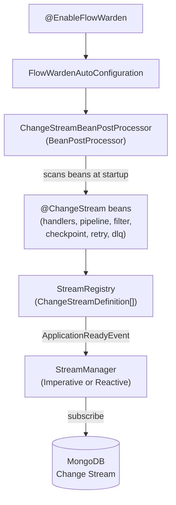
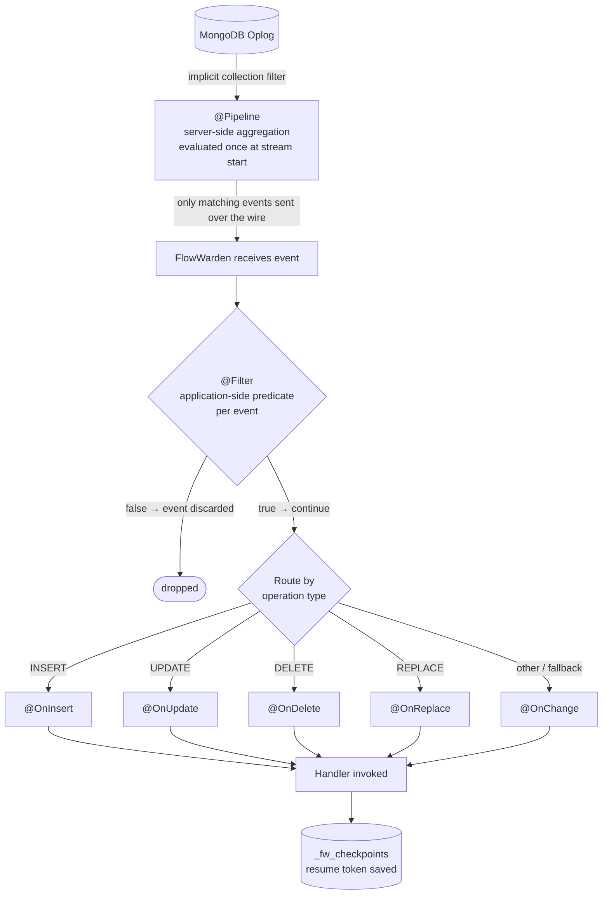

FlowWarden wraps MongoDB Change Streams into a declarative, annotation-driven programming model managed by Spring Boot auto-configuration. This page explains what happens under the hood — from application startup to handler invocation.

## The Big Picture



---

## Phase 1 — Startup: Bean Discovery

When the application context boots, Spring initializes all beans. `ChangeStreamBeanPostProcessor` is a `BeanPostProcessor` registered by the auto-configuration — it intercepts every bean after initialization and inspects its class for the `@ChangeStream` annotation.

For each discovered `@ChangeStream` class, the processor:

1. **Resolves the stream name and target collection** — from `name`, `value`, `collection`, or inferred from `documentType` via the Spring Data `@Document` annotation.
2. **Discovers handler methods** — scans declared methods for `@OnChange`, `@OnInsert`, `@OnUpdate`, `@OnDelete`, and `@OnReplace`, validates their signatures and return types.
3. **Discovers the pipeline** — finds the optional `@Pipeline` method and inspects its return type (`List<Bson>`, `List<AggregationOperation>`, or `Aggregation`).
4. **Discovers the filter** — finds the optional `@Filter` method and checks it returns `Predicate<ChangeStreamContext<?>>` or `boolean filter(ChangeStreamContext<?> ctx)`.
5. **Validates the configuration** — catches misconfigurations early (e.g., `@Filter` combined with `@OnDelete`, missing handlers, wrong return types for the configured mode).
6. **Registers a `ChangeStreamDefinition`** in the `StreamRegistry`.

<Note>
All validation happens at startup, not at runtime. Misconfigured streams fail fast with a clear `BeanCreationException` before the application finishes booting.
</Note>

---

## Phase 2 — Startup: Stream Launch

Once the application context is fully ready (`ApplicationReadyEvent`), the `StreamManager` iterates the `StreamRegistry` and starts every stream where `autoStart = true` and `enabled = true`.

<CodeGroup>

```java Imperative (MongoTemplate)
// ImperativeStreamManager — uses Spring Data's MessageListenerContainer
MessageListenerContainer container = new DefaultMessageListenerContainer(mongoTemplate);
container.start();

ChangeStreamRequest<Document> request = ChangeStreamRequest.builder(listener)
    .collection(def.collection())
    .pipeline(pipeline)          // @Pipeline stages, evaluated once here
    .resumeToken(lastToken)      // null on first start; loaded from _fw_checkpoints on restart
    .build();

container.register(request, Document.class);
```

```java Reactive (ReactiveMongoTemplate)
// ReactiveStreamManager — uses Project Reactor + ReactiveMongoTemplate
reactiveMongoTemplate
    .changeStream(def.collection(), options, Document.class)
    .doOnNext(event -> dispatch(def, event))
    .subscribe();
```

</CodeGroup>

If a checkpoint was previously saved in `_fw_checkpoints`, the resume token is loaded and passed to MongoDB so the stream resumes exactly where it left off — no events are missed or replayed.

---

## Phase 3 — Runtime: Event Processing Pipeline

Every Change Stream event flows through the following stages before reaching your handler:



### @Pipeline vs @Filter

<Tabs>
  <Tab title="@Pipeline — Server-side">
    Pushed to MongoDB at **stream subscription time**. MongoDB evaluates the aggregation pipeline in the oplog and only sends matching events over the wire. This is the most efficient approach — it reduces network traffic and application load.

    ```java
    @Pipeline
    List<Bson> pipeline() {
        return List.of(
            Aggregates.match(Filters.in("operationType", "insert", "update")),
            Aggregates.match(Filters.eq("fullDocument.status", "PAID"))
        );
    }
    ```
  </Tab>
  <Tab title="@Filter — Application-side">
    Evaluated by FlowWarden **on every event received**, after `@Pipeline`. Useful for logic that requires Spring bean injection or cannot be expressed as a MongoDB aggregation.

    ```java
    @Filter
    boolean filter(ChangeStreamContext<Order> ctx) {
        return tenantService.isActive(ctx.getFullDocument(Order.class).getTenantId());
    }
    ```
  </Tab>
  <Tab title="Combined — Funnel approach">
    The two approaches are complementary. Use `@Pipeline` to reduce network traffic, then `@Filter` for precise application-level control.

    ```mermaid
    flowchart LR
        A[("Full oplog")] -->|"server-side"| B["@Pipeline<br/>MongoDB aggregation"]
        B -->|"app-side"| C["@Filter<br/>Java predicate"]
        C --> D["Handler"]
    ```
  </Tab>
</Tabs>

---

## Dual Execution Mode

FlowWarden supports two execution modes, configured via `flowwarden.default-mode`.

| Mode | Infrastructure | Handler return type | Use with |
|------|---------------|---------------------|----------|
| `IMPERATIVE` | `MongoTemplate` + `MessageListenerContainer` | `void` | Spring MVC, blocking I/O |
| `REACTIVE` | `ReactiveMongoTemplate` + Project Reactor | `Mono<Void>` | Spring WebFlux, non-blocking I/O |

The mode is validated at startup: a `void` handler in `REACTIVE` mode or a `Mono<Void>` handler in `IMPERATIVE` mode causes a `BeanCreationException`.

<CodeGroup>

```java Imperative handler
@ChangeStream(collection = "orders")
public class OrderStream {

    @OnInsert
    void onInsert(Order order, ChangeStreamContext<Order> ctx) {
        // blocking code — fine in IMPERATIVE mode
        repository.save(order);
    }
}
```

```java Reactive handler
@ChangeStream(collection = "orders")
public class OrderStream {

    @OnInsert
    Mono<Void> onInsert(Order order, ChangeStreamContext<Order> ctx) {
        // non-blocking — required in REACTIVE mode
        return repository.save(order).then();
    }
}
```

</CodeGroup>

---

## Internal MongoDB Collections

FlowWarden uses three internal collections in your database. You do not need to create them — they are managed automatically.

| Collection | Purpose |
|-----------|---------|
| `_fw_checkpoints` | Stores resume tokens for each stream. Loaded on startup to resume from the last processed event. |
| `_fw_dlq` | Dead Letter Queue. Failed events that exhausted all retry attempts are written here. |
| `_fw_locks` | Distributed locks for `SINGLE_LEADER` deployment mode. Used for leader election across multiple instances. |

<Note>
All internal collections are prefixed with `_fw_` to avoid collisions with your application data. They are created with appropriate indexes on first use.
</Note>

---

## Handler Signatures

FlowWarden resolves the correct invocation strategy at startup based on the method signature.

<Accordion title="Typed handler signatures (@OnInsert, @OnUpdate, @OnDelete, @OnReplace)">

| Signature | Description |
|-----------|-------------|
| `void handle(ChangeStreamContext<T> ctx)` | Full event context — operation type, document key, update description, resume token |
| `void handle(T doc)` | Document directly — requires `documentType` on `@ChangeStream` |
| `void handle(T doc, ChangeStreamContext<T> ctx)` | Both document and context |
| `Mono<Void> handle(ChangeStreamContext<T> ctx)` | Reactive variant (REACTIVE mode only) |

</Accordion>

<Accordion title="@OnChange — generic handler">

`@OnChange` handles all operation types not covered by a specific typed handler (or all types if no typed handlers are declared). It always receives a `ChangeStreamContext<?>`.

```java
@OnChange
void handle(ChangeStreamContext<?> ctx) {
    // handles INSERT, UPDATE, DELETE, REPLACE, DROP, INVALIDATE, ...
}
```

Use `operationTypes` to restrict which operations this handler covers:

```java
@OnChange(operationTypes = { OperationType.INSERT, OperationType.REPLACE })
void handle(ChangeStreamContext<?> ctx) { ... }
```

</Accordion>

---

## See Also

<CardGroup cols={2}>
  <Card title="@ChangeStream" icon="code" href="/reference/change-stream">
    Full annotation reference with all attributes
  </Card>
  <Card title="Checkpoint & Resume" icon="bookmark" href="/guides/checkpoint-resume">
    How resume tokens are stored and replayed on restart
  </Card>
  <Card title="Filtering Events" icon="filter" href="/guides/filtering-events">
    When to use @Pipeline vs @Filter
  </Card>
  <Card title="Imperative vs Reactive" icon="arrows-left-right" href="/guides/imperative-vs-reactive">
    Choosing the right execution mode
  </Card>
</CardGroup>
