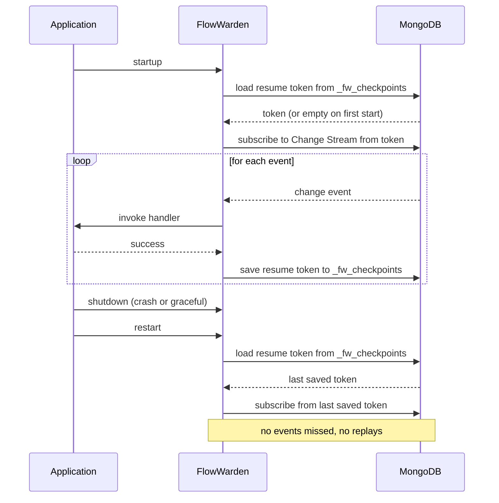

Without checkpointing, a restarted application starts consuming from the latest MongoDB event — all events that arrived during the downtime are silently lost. With `@Checkpoint`, FlowWarden saves a **resume token** to MongoDB after each processed event, and reloads it on startup to continue exactly where it left off.

---

## Quick setup

Add `@Checkpoint` to any `@ChangeStream` class:

```java
@ChangeStream(documentType = Order.class)
@Checkpoint
public class OrderStream {

    @OnChange
    void handle(ChangeStreamContext<Order> ctx) {
        System.out.println(ctx.summary());
    }
}
```

That's it. With default settings, the resume token is saved after every processed event and reloaded automatically on the next startup.

---

## How it works



---

## Saving strategies

Two independent mechanisms control when the resume token is persisted. They can be used together.

### Every N events — `saveEveryN`

Saves the token after every N **successfully processed** events. The counter increments only on success — failed events do not advance it.

```java
// Save after every event (default — safest, small overhead)
@Checkpoint

// Save every 10 events (lower write pressure, up to 9 events at risk on crash)
@Checkpoint(saveEveryN = 10)
```

<Warning>
With `saveEveryN = 10`, a crash between checkpoints means the last up-to-9 events are **reprocessed** on restart. Make sure your handlers are idempotent if you increase this value.
</Warning>

### Periodic timer — `saveIntervalSeconds`

Saves the latest received token on a fixed schedule, regardless of event volume. This acts as a **heartbeat** — the token advances even on low-traffic streams where `saveEveryN` would take a long time to trigger.

```java
// Save every 5 seconds (default)
@Checkpoint

// Save every 30 seconds
@Checkpoint(saveIntervalSeconds = 30)

// Disable periodic saving entirely
@Checkpoint(saveIntervalSeconds = 0)
```

<Note>
The periodic timer saves the token of the **last event received**, even if it was not yet checkpointed by `saveEveryN`. This means the two mechanisms are complementary: `saveEveryN` tracks processed events precisely, the timer provides a safety net for idle periods.
</Note>

### Combining both

Both mechanisms are active by default. The token is saved whichever fires first:

```java
// Save every 50 events OR every 10 seconds — whichever comes first
@Checkpoint(saveEveryN = 50, saveIntervalSeconds = 10)
```

<Tip>
For high-throughput streams, increase `saveEveryN` to reduce write pressure and keep `saveIntervalSeconds` as a fallback. For low-traffic streams, rely primarily on `saveIntervalSeconds`.
</Tip>

---

## Start position

`startPosition` controls where the stream starts consuming when it boots.

| Value | Behaviour |
|-------|-----------|
| `RESUME` *(default)* | Load the checkpoint from `_fw_checkpoints`. If none exists (first start), begin from the latest event. |
| `LATEST` | Ignore any existing checkpoint and start from the latest event. Previous events are never replayed. |

```java
// Resume from last checkpoint (production default)
@Checkpoint(startPosition = StartPosition.RESUME)

// Always start fresh — useful for stateless consumers (e.g. cache warming)
@Checkpoint(startPosition = StartPosition.LATEST)
```

<Warning>
`startPosition = LATEST` **deletes the effective checkpoint** on each restart. Use it only for streams where missing past events is acceptable (e.g. cache invalidation, live dashboards).
</Warning>

---

## Attribute reference

```java
@Checkpoint(
    strategy          = CheckpointStrategy.MONGODB,  // storage backend
    saveEveryN        = 1,                           // checkpoint every N events
    saveIntervalSeconds = 5,                         // periodic heartbeat (0 = disabled)
    startPosition     = StartPosition.RESUME         // where to start on boot
)
```

| Attribute | Type | Default | Description |
|-----------|------|---------|-------------|
| `strategy` | `CheckpointStrategy` | `MONGODB` | Storage backend. Currently only `MONGODB` is supported. |
| `saveEveryN` | `int` | `1` | Save after every N successfully processed events. Must be > 0. |
| `saveIntervalSeconds` | `int` | `5` | Periodic save interval in seconds. Set to `0` to disable. Must be ≥ 0. |
| `startPosition` | `StartPosition` | `RESUME` | `RESUME` to reload last checkpoint; `LATEST` to ignore it. |

---

## Internal storage

Checkpoints are stored in the `_fw_checkpoints` collection of your MongoDB database. The collection is created automatically on first use.

Each document is keyed by stream name and contains the resume token and metadata:

```json
{
  "_id": "order-stream",
  "lastProcessedToken": { "$binary": { ... } },
  "lastProcessedAt": "2026-02-25T10:00:00Z"
}
```

You can inspect checkpoints directly, or delete a stream's checkpoint to force a reset on the next restart:

```js
// Inspect all checkpoints
db._fw_checkpoints.find()

// Force reset a specific stream
db._fw_checkpoints.deleteOne({ _id: "order-stream" })
```

---

## Common patterns

<Accordion title="Exactly-once semantics">
FlowWarden provides **at-least-once** delivery by default. A crash between processing and checkpointing causes the last few events to be reprocessed on restart.

To approach exactly-once, save the checkpoint inside the same database transaction as your business write:

```java
@OnInsert
void onInsert(Order order, ChangeStreamContext<Order> ctx) {
    // business write + checkpoint in one transaction
    mongoTemplate.save(order, "processed_orders");
    ctx.saveCheckpointNow();  // explicit immediate checkpoint
}
```

`ctx.saveCheckpointNow()` forces an immediate checkpoint save outside the `saveEveryN` counter.
</Accordion>

<Accordion title="Disabling checkpoint for dev/test">
Omit `@Checkpoint` entirely — no tokens are persisted and the stream always starts from the latest event:

```java
@ChangeStream(collection = "orders")
public class OrderStream {
    // no @Checkpoint — stateless, always starts from latest
    @OnChange
    void handle(ChangeStreamContext<?> ctx) { ... }
}
```
</Accordion>

<Accordion title="Multiple streams, independent checkpoints">
Each stream has its own checkpoint entry in `_fw_checkpoints`, keyed by stream name. Two streams on the same collection checkpoint independently:

```java
@ChangeStream(name = "billing-stream", collection = "orders")
@Checkpoint(saveEveryN = 1)
public class BillingStream { ... }

@ChangeStream(name = "notification-stream", collection = "orders")
@Checkpoint(saveEveryN = 50, saveIntervalSeconds = 10)
public class NotificationStream { ... }
```
</Accordion>

---

## See Also

<CardGroup cols={2}>
  <Card title="@Checkpoint reference" icon="code" href="/reference/checkpoint">
    Full annotation reference
  </Card>
  <Card title="How it Works" icon="gears" href="/concepts/how-it-works">
    Where checkpointing fits in the event processing pipeline
  </Card>
  <Card title="Filtering Events" icon="filter" href="/guides/filtering-events">
    How filtered events interact with resume tokens
  </Card>
  <Card title="Deployment Modes" icon="server" href="/guides/deployment-modes">
    Checkpointing in multi-instance deployments
  </Card>
</CardGroup>
