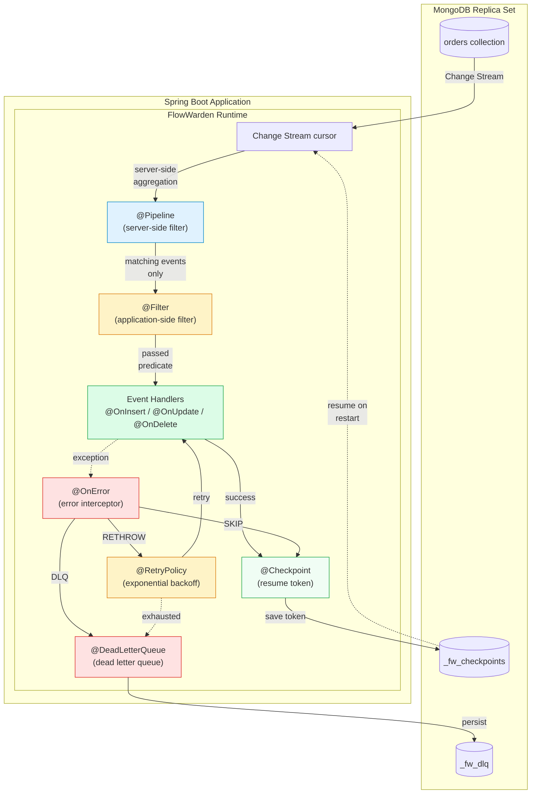
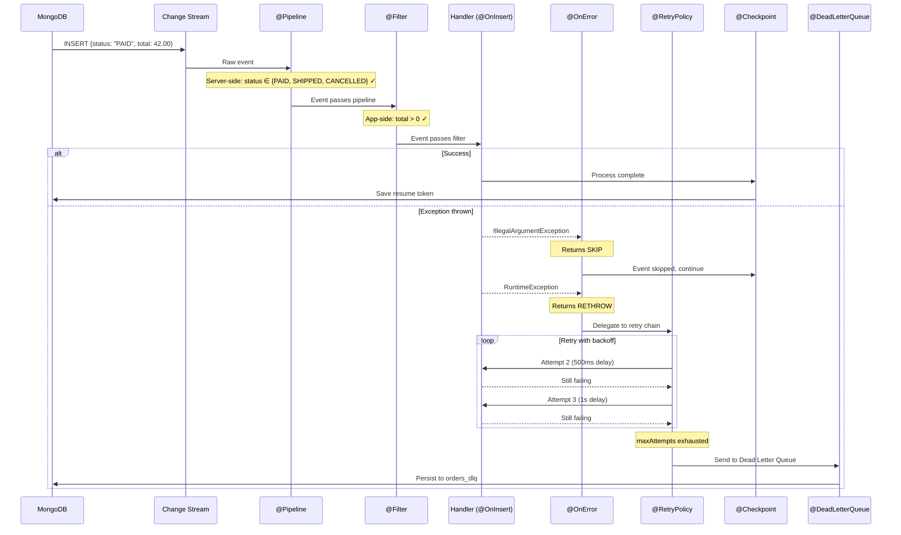
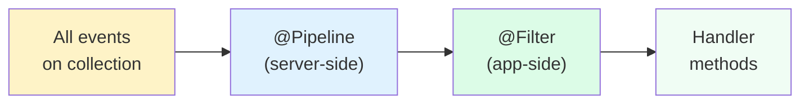
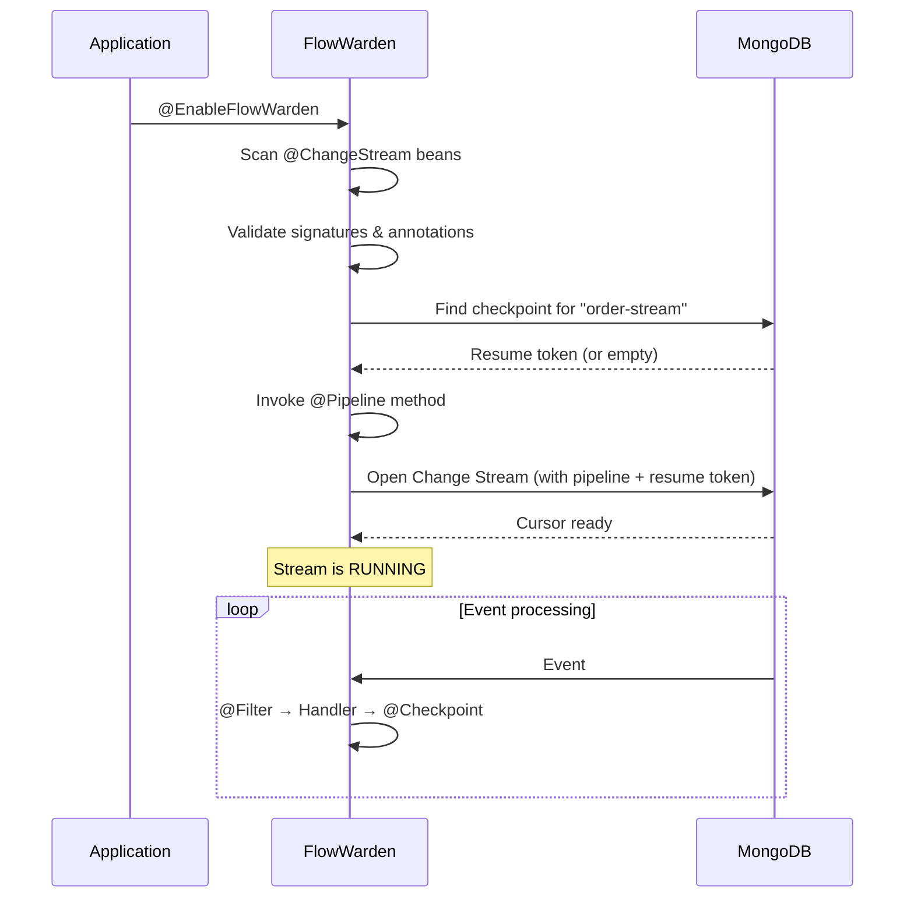

This guide walks through a **production-ready order processing handler** that uses every FlowWarden annotation together: `@ChangeStream`, `@Checkpoint`, `@Pipeline`, `@Filter`, `@RetryPolicy`, `@DeadLetterQueue`, and `@OnError`.

## Architecture Overview



## Full Handler Code

<CodeGroup>

```java Imperative
@ChangeStream(
    name              = "order-stream",
    collection        = "orders",
    documentType      = Order.class,
    operationTypes    = { OperationType.INSERT, OperationType.UPDATE, OperationType.DELETE },
    fullDocument      = FullDocumentMode.UPDATE_LOOKUP,
    deploymentMode    = DeploymentMode.SINGLE_LEADER
)
@Checkpoint(saveEveryN = 5, saveIntervalSeconds = 10)
@RetryPolicy(maxAttempts = 5, initialDelay = "500ms", multiplier = 2.0, maxDelay = "30s")
@DeadLetterQueue(collection = "orders_dlq", ttlDays = 90)
public class OrderStreamHandler {

    private static final Logger log = LoggerFactory.getLogger(OrderStreamHandler.class);

    private final OrderService orderService;
    private final NotificationService notificationService;

    public OrderStreamHandler(OrderService orderService,
                              NotificationService notificationService) {
        this.orderService = orderService;
        this.notificationService = notificationService;
    }

    // ── Server-side filter: only PAID, SHIPPED, CANCELLED orders reach the app ──

    @Pipeline
    List<Bson> pipeline() {
        return List.of(
            Aggregates.match(Filters.in("fullDocument.status",
                "PAID", "SHIPPED", "CANCELLED"))
        );
    }

    // ── Application-side filter: skip orders with zero total ──

    @Filter
    boolean filter(ChangeStreamContext<Order> ctx) {
        return ctx.getFullDocument(Order.class)
                .map(order -> order.getTotal() > 0)
                .orElse(true);   // allow DELETEs (no fullDocument)
    }

    // ── Event handlers ──

    @OnInsert
    void onNewOrder(ChangeStreamContext<Order> ctx) {
        Order order = ctx.getFullDocument(Order.class).orElseThrow();
        log.info("New order {} — total: {}", order.getId(), order.getTotal());
        orderService.process(order);
        notificationService.sendNewOrderAlert(order);
    }

    @OnUpdate
    void onOrderUpdated(ChangeStreamContext<Order> ctx) {
        UpdateDescription update = ctx.getUpdateDescription();
        if (update.hasFieldChanged("status")) {
            String newStatus = update.getUpdatedFieldValue("status", String.class);
            log.info("Order {} status → {}", ctx.getDocumentKey(), newStatus);
            orderService.handleStatusChange(ctx.getDocumentKey(), newStatus);
        }
    }

    @OnDelete
    void onOrderDeleted(ChangeStreamContext<Order> ctx) {
        log.warn("Order deleted: {}", ctx.getDocumentKey());
    }

    // ── Error handling ──

    @OnError(IllegalArgumentException.class)
    ErrorAction onValidation(Throwable ex, ChangeStreamContext<?> ctx) {
        log.warn("Validation error on order {}, skipping: {}",
            ctx.getDocumentKey(), ex.getMessage());
        return ErrorAction.SKIP;
    }

    @OnError
    ErrorAction catchAll(Throwable ex, ChangeStreamContext<?> ctx) {
        log.error("Error processing order {} (attempt {}): {}",
            ctx.getDocumentKey(), ctx.getAttemptNumber(), ex.getMessage());
        return ErrorAction.RETHROW;
    }
}
```

```java Reactive
@ChangeStream(
    name              = "order-stream",
    collection        = "orders",
    documentType      = Order.class,
    operationTypes    = { OperationType.INSERT, OperationType.UPDATE, OperationType.DELETE },
    fullDocument      = FullDocumentMode.UPDATE_LOOKUP,
    deploymentMode    = DeploymentMode.SINGLE_LEADER
)
@Checkpoint(saveEveryN = 5, saveIntervalSeconds = 10)
@RetryPolicy(maxAttempts = 5, initialDelay = "500ms", multiplier = 2.0, maxDelay = "30s")
@DeadLetterQueue(collection = "orders_dlq", ttlDays = 90)
public class OrderStreamHandler {

    private static final Logger log = LoggerFactory.getLogger(OrderStreamHandler.class);

    private final OrderService orderService;
    private final NotificationService notificationService;

    public OrderStreamHandler(OrderService orderService,
                              NotificationService notificationService) {
        this.orderService = orderService;
        this.notificationService = notificationService;
    }

    // ── Server-side filter: only PAID, SHIPPED, CANCELLED orders reach the app ──

    @Pipeline
    List<Bson> pipeline() {
        return List.of(
            Aggregates.match(Filters.in("fullDocument.status",
                "PAID", "SHIPPED", "CANCELLED"))
        );
    }

    // ── Application-side filter: skip orders with zero total ──

    @Filter
    boolean filter(ChangeStreamContext<Order> ctx) {
        return ctx.getFullDocument(Order.class)
                .map(order -> order.getTotal() > 0)
                .orElse(true);
    }

    // ── Event handlers ──

    @OnInsert
    Mono<Void> onNewOrder(ChangeStreamContext<Order> ctx) {
        Order order = ctx.getFullDocument(Order.class).orElseThrow();
        log.info("New order {} — total: {}", order.getId(), order.getTotal());
        return orderService.processReactive(order)
            .then(notificationService.sendNewOrderAlertReactive(order));
    }

    @OnUpdate
    Mono<Void> onOrderUpdated(ChangeStreamContext<Order> ctx) {
        UpdateDescription update = ctx.getUpdateDescription();
        if (update.hasFieldChanged("status")) {
            String newStatus = update.getUpdatedFieldValue("status", String.class);
            log.info("Order {} status → {}", ctx.getDocumentKey(), newStatus);
            return orderService.handleStatusChangeReactive(ctx.getDocumentKey(), newStatus);
        }
        return Mono.empty();
    }

    @OnDelete
    Mono<Void> onOrderDeleted(ChangeStreamContext<Order> ctx) {
        log.warn("Order deleted: {}", ctx.getDocumentKey());
        return Mono.empty();
    }

    // ── Error handling (always synchronous, even in reactive mode) ──

    @OnError(IllegalArgumentException.class)
    ErrorAction onValidation(Throwable ex, ChangeStreamContext<?> ctx) {
        log.warn("Validation error on order {}, skipping: {}",
            ctx.getDocumentKey(), ex.getMessage());
        return ErrorAction.SKIP;
    }

    @OnError
    ErrorAction catchAll(Throwable ex, ChangeStreamContext<?> ctx) {
        log.error("Error processing order {} (attempt {}): {}",
            ctx.getDocumentKey(), ctx.getAttemptNumber(), ex.getMessage());
        return ErrorAction.RETHROW;
    }
}
```

</CodeGroup>

## Event Processing Flow

This diagram shows the complete lifecycle of a single event through the handler:



## Annotation Breakdown

Each annotation controls a specific aspect of the processing pipeline:

| Annotation | Level | Purpose | Key Attributes |
|-----------|-------|---------|----------------|
| `@ChangeStream` | Class | Declares the stream, binds to a collection | `name`, `collection`, `documentType`, `fullDocument`, `deploymentMode` |
| `@Checkpoint` | Class | Persists resume tokens for crash recovery | `saveEveryN`, `saveIntervalSeconds`, `startPosition` |
| `@RetryPolicy` | Class | Retries failed handlers with exponential backoff | `maxAttempts`, `initialDelay`, `multiplier`, `maxDelay`, `jitter` |
| `@DeadLetterQueue` | Class | Captures events that exhaust all retries | `collection`, `ttlDays`, `includeOriginalDocument` |
| `@Pipeline` | Method | Server-side MongoDB aggregation filter | *(no attributes — returns `List<Bson>` or `Aggregation`)* |
| `@Filter` | Method | Application-side Java predicate filter | *(no attributes — returns `boolean` or `Predicate`)* |
| `@OnInsert` / `@OnUpdate` / `@OnDelete` | Method | Typed event handlers | *(none)* |
| `@OnError` | Method | Custom error interceptor, returns `ErrorAction` | `value` (exception types) |

## Filtering Funnel

Events pass through two filtering stages before reaching your handlers:



| Stage | Where | When | Use For |
|-------|-------|------|---------|
| `@Pipeline` | MongoDB server | Once at startup | Field-based matching, operation type filtering. Reduces network traffic. |
| `@Filter` | Your JVM | Every event | Complex logic, service calls, runtime conditions. Runs after `@Pipeline`. |

<Tip>
  Always push as much filtering as possible into `@Pipeline`. Server-side filtering reduces network traffic and CPU usage — `@Filter` should only handle logic that MongoDB aggregation can't express.
</Tip>

## Error Handling Chain

When a handler throws, FlowWarden resolves the error through this chain:

```mermaid
flowchart TD
    EX["Handler throws exception"] --> M1{Exact @OnError\nmatch?}
    M1 -->|Yes| A1[Invoke handler]
    M1 -->|No| M2{Parent type\n@OnError match?}
    M2 -->|Yes| A1
    M2 -->|No| M3{Catch-all\n@OnError?}
    M3 -->|Yes| A1
    M3 -->|No| STD[Standard retry/DLQ chain]

    A1 --> EA{ErrorAction?}
    EA -->|SKIP| SK["⏭️ Skip event\n(log warning)"]
    EA -->|RETRY| RT["🔄 Retry\n(respects maxAttempts)"]
    EA -->|DLQ| DQ["📥 Send to DLQ\n(bypass retries)"]
    EA -->|RETHROW| STD

    STD --> RP{@RetryPolicy\npresent?}
    RP -->|Yes| R2["Retry with\nexponential backoff"]
    RP -->|No| DL{@DeadLetterQueue\npresent?}
    R2 -->|Exhausted| DL
    R2 -->|Success| OK["✅ Processed"]
    DL -->|Yes| DQ
    DL -->|No| LOST["❌ Event lost"]

    style SK fill:#fef3c7
    style RT fill:#e0f2fe
    style DQ fill:#fee2e2
    style OK fill:#dcfce7
    style LOST fill:#fca5a5
```

## Retry Backoff Timeline

With `@RetryPolicy(maxAttempts = 5, initialDelay = "500ms", multiplier = 2.0)`:

```mermaid
gantt
    title Retry timeline for a persistently failing event
    dateFormat X
    axisFormat %L ms

    section Processing
    Attempt 1 (initial)      :a1, 0, 100
    Backoff 500ms            :crit, b1, 100, 600
    Attempt 2                :a2, 600, 700
    Backoff 1s               :crit, b2, 700, 1700
    Attempt 3                :a3, 1700, 1800
    Backoff 2s               :crit, b3, 1800, 3800
    Attempt 4                :a4, 3800, 3900
    Backoff 4s               :crit, b4, 3900, 7900
    Attempt 5 (last)         :a5, 7900, 8000
    Sent to DLQ              :done, d1, 8000, 8100
```



## Application Setup

```java
@SpringBootApplication
@EnableFlowWarden
public class MyApp {
    public static void main(String[] args) {
        SpringApplication.run(MyApp.class, args);
    }
}
```

```yaml
# application.yml
flowwarden:
  default-mode: IMPERATIVE     # or REACTIVE

spring:
  data:
    mongodb:
      uri: mongodb://localhost:27017/mydb   # Must be a Replica Set
```

<Note>
  `@ChangeStream` is meta-annotated with `@Component` — no need to add `@Component` or register the handler class separately. FlowWarden discovers it automatically via `@EnableFlowWarden`.
</Note>

## What Happens at Startup

When the application starts, FlowWarden:

1. **Scans** for classes annotated with `@ChangeStream`
2. **Validates** all handler signatures, annotation combinations, and constraints
3. **Restores** the last checkpoint from `_fw_checkpoints` (if any)
4. **Evaluates** the `@Pipeline` method once and passes it to MongoDB
5. **Opens** the Change Stream cursor (resuming from checkpoint if available)
6. **Dispatches** events through `@Filter` → handlers → `@Checkpoint`



## Best Practices

- **Use `fullDocument = UPDATE_LOOKUP`** when your `@Filter` or handlers need the full document on UPDATE events. Without it, only the changed fields are available.
- **Set `saveEveryN` > 1 for high-throughput streams** to reduce checkpoint writes. A value of `5–10` is a good balance between performance and replay risk.
- **Keep `@OnError` handlers simple** — they should make fast decisions, not call external services.
- **Combine `@Pipeline` + `@Filter`** for a double-filtering funnel: MongoDB pre-filters server-side (reducing network traffic), then Java refines with complex logic.
- **Always have `@DeadLetterQueue`** on production streams so failed events are never silently lost.

## See Also

<CardGroup cols={2}>
  <Card title="@ChangeStream" icon="database" href="/reference/change-stream">
    Full reference for the main annotation
  </Card>
  <Card title="@Checkpoint" icon="bookmark" href="/reference/checkpoint">
    Resume token persistence configuration
  </Card>
  <Card title="@RetryPolicy" icon="rotate-right" href="/reference/retry-policy">
    Exponential backoff retry configuration
  </Card>
  <Card title="@DeadLetterQueue" icon="box-archive" href="/reference/dead-letter-queue">
    Failed event capture and storage
  </Card>
  <Card title="@OnError" icon="triangle-exclamation" href="/reference/on-error">
    Custom error handling with ErrorAction
  </Card>
  <Card title="Filtering Events" icon="filter" href="/guides/filtering-events">
    Guide to @Pipeline and @Filter
  </Card>
</CardGroup>
