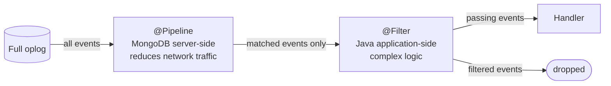

FlowWarden provides two complementary filtering mechanisms. They answer a different question each:

| | `@Pipeline` | `@Filter` |
|---|---|---|
| **Where it runs** | MongoDB server | Your JVM |
| **When it runs** | Once at stream startup | On every received event |
| **What it filters** | Events crossing the wire | Events dispatched to handlers |
| **Best for** | Reducing network traffic | Complex logic, Spring beans, service calls |

Use `@Pipeline` as your first line of defense — events that don't match never leave MongoDB. Use `@Filter` when the decision requires Java code that can't be expressed as an aggregation stage.

---

## @Pipeline — Server-side filtering

The `@Pipeline` method returns an aggregation pipeline that MongoDB applies directly in the oplog. Only matching events are sent to your application over the wire.

**The method is called once at stream startup** — the pipeline is static for the lifetime of the stream.

### Signatures

Three return types are supported:

<Tabs>
  <Tab title="List&lt;Bson&gt;">
    Native MongoDB driver — most explicit, no Spring dependency:

    ```java
    @ChangeStream(documentType = Order.class)
    public class OrderStream {

        @Pipeline
        List<Bson> pipeline() {
            return List.of(
                Aggregates.match(Filters.in("operationType", "insert", "update"))
            );
        }

        @OnInsert
        void onInsert(Order doc, ChangeStreamContext<Order> ctx) { ... }

        @OnUpdate
        void onUpdate(ChangeStreamContext<Order> ctx) { ... }
    }
    ```
  </Tab>
  <Tab title="Aggregation (Spring Data)">
    Spring Data `Aggregation` — integrates with the Spring ecosystem:

    ```java
    @ChangeStream(documentType = Order.class, fullDocument = FullDocumentMode.UPDATE_LOOKUP)
    public class OrderStream {

        @Pipeline
        Aggregation pipeline() {
            return Aggregation.newAggregation(
                Aggregation.match(
                    Criteria.where("operationType").in("insert", "update")
                )
            );
        }

        @OnInsert
        void onInsert(Order doc, ChangeStreamContext<Order> ctx) { ... }
    }
    ```
  </Tab>
  <Tab title="List&lt;AggregationOperation&gt;">
    Spring Data operations list — useful to compose stages programmatically:

    ```java
    @Pipeline
    List<AggregationOperation> pipeline() {
        return List.of(
            Aggregation.match(Criteria.where("operationType").is("insert")),
            Aggregation.match(Criteria.where("fullDocument.status").is("PAID"))
        );
    }
    ```
  </Tab>
</Tabs>

<Tip>
`List<Bson>` and Spring Data `Aggregation` are the most common choices. Use `List<Bson>` when you are already using the MongoDB driver directly; use `Aggregation` when you prefer to stay in the Spring Data world.
</Tip>

---

## @Filter — Application-side filtering

The `@Filter` method is a Java predicate evaluated **on every event received** by FlowWarden, before the event is dispatched to your handler. Events that don't pass the filter are silently dropped — their resume token is still tracked.

Because `@Filter` runs in Java, it can call Spring services, access request context, or apply any logic that cannot be expressed as a MongoDB aggregation stage.

### Signatures

Two styles are supported:

<Tabs>
  <Tab title="boolean method">
    Takes a `ChangeStreamContext` and returns a `boolean` — the most readable style:

    ```java
    @ChangeStream(documentType = Order.class, fullDocument = FullDocumentMode.UPDATE_LOOKUP)
    public class OrderStream {

        @Filter
        boolean filter(ChangeStreamContext<Order> ctx) {
            return ctx.getFullDocument(Order.class)
                .map(order -> order.getTotal().compareTo(new BigDecimal("100")) > 0)
                .orElse(false);
        }

        @OnInsert
        void onInsert(Order doc, ChangeStreamContext<Order> ctx) { ... }

        @OnUpdate
        void onUpdate(ChangeStreamContext<Order> ctx) { ... }
    }
    ```
  </Tab>
  <Tab title="Predicate factory">
    No-parameter method that returns a `Predicate` — useful to capture a Spring bean once:

    ```java
    @ChangeStream(documentType = Order.class, fullDocument = FullDocumentMode.UPDATE_LOOKUP)
    public class OrderStream {

        @Autowired
        private TenantService tenantService;

        @Filter
        Predicate<ChangeStreamContext<?>> filter() {
            return ctx -> ((ChangeStreamContext<Order>) ctx)
                .getFullDocument(Order.class)
                .map(order -> tenantService.isActive(order.getTenantId()))
                .orElse(false);
        }

        @OnInsert
        void onInsert(Order doc, ChangeStreamContext<Order> ctx) { ... }
    }
    ```
  </Tab>
</Tabs>

---

## Combining both — the funnel approach

`@Pipeline` and `@Filter` can coexist on the same `@ChangeStream`. MongoDB pre-filters server-side, then Java refines application-side. This is the most efficient pattern for high-throughput streams with complex filtering needs.



**Example** — pre-filter by operation type server-side, then check business logic in Java:

```java
@ChangeStream(documentType = Order.class, fullDocument = FullDocumentMode.UPDATE_LOOKUP)
public class OrderStream {

    @Autowired
    private TenantService tenantService;

    /** Server-side: only INSERT and UPDATE events leave MongoDB */
    @Pipeline
    Aggregation pipeline() {
        return Aggregation.newAggregation(
            Aggregation.match(Criteria.where("operationType").in("insert", "update"))
        );
    }

    /** Application-side: only orders from active tenants reach the handler */
    @Filter
    Predicate<ChangeStreamContext<?>> filter() {
        return ctx -> ((ChangeStreamContext<Order>) ctx)
            .getFullDocument(Order.class)
            .map(order -> tenantService.isActive(order.getTenantId()))
            .orElse(false);
    }

    @OnInsert
    void onInsert(Order doc, ChangeStreamContext<Order> ctx) { ... }

    @OnUpdate
    void onUpdate(ChangeStreamContext<Order> ctx) { ... }
}
```

---

## Constraints and pitfalls

<Warning>
**`@Filter` requires `fullDocument` for UPDATE events.**

By default (`fullDocument = DEFAULT`), MongoDB does not include the full document in UPDATE events. If your `@Filter` accesses `getFullDocument()` on an UPDATE event, it will receive `Optional.empty()` and likely drop the event silently.

Set `fullDocument = FullDocumentMode.UPDATE_LOOKUP` on `@ChangeStream` when using `@Filter` with `@OnUpdate`:

```java
@ChangeStream(documentType = Order.class, fullDocument = FullDocumentMode.UPDATE_LOOKUP)
```
</Warning>

<Warning>
**`@Filter` is incompatible with `@OnDelete`, `@OnChange` (unrestricted).**

DELETE, DROP, and INVALIDATE events never carry a `fullDocument`. Combining `@Filter` (which typically accesses the document) with handlers covering these operations is rejected at startup with a `BeanCreationException`.

If you need both filtering and DELETE handling, use a server-side `@Pipeline` to filter, or move the filtering logic inside the handler method itself.
</Warning>

<Accordion title="What happens to filtered events?">
Events rejected by `@Filter` are silently dropped — they never reach any handler method. Their resume token is still tracked internally, so checkpointing is not affected. Filtered events are not sent to the Dead Letter Queue.

If you need to log or count filtered events, use the `boolean filter(ChangeStreamContext<?> ctx)` style and add your own logging before returning `false`.
</Accordion>

<Accordion title="@Pipeline stages and operationType">
The most common first stage in a `@Pipeline` is filtering by `operationType`:

```java
Aggregates.match(Filters.in("operationType", "insert", "update"))
```

This is equivalent to the `operationTypes` attribute on `@ChangeStream` but expressed as an aggregation stage. You can combine both, though declaring it in `@Pipeline` gives you more flexibility (e.g. pairing with additional field conditions in the same `$match`).
</Accordion>

---

## See Also

<CardGroup cols={2}>
  <Card title="@Pipeline reference" icon="code" href="/reference/pipeline">
    All supported return types and validation rules
  </Card>
  <Card title="@Filter reference" icon="code" href="/reference/filter">
    Signature styles and startup validation
  </Card>
  <Card title="How it Works" icon="gears" href="/concepts/how-it-works">
    Where filtering fits in the event processing pipeline
  </Card>
  <Card title="Checkpoint & Resume" icon="bookmark" href="/guides/checkpoint-resume">
    How filtered events interact with resume tokens
  </Card>
</CardGroup>
