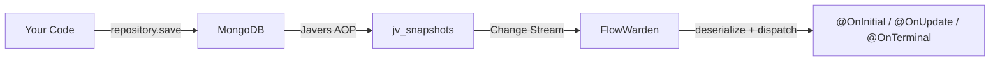

[Javers](https://javers.org) is a popular Java library for auditing and tracking changes to domain objects. FlowWarden Javers connects Javers audit snapshots to FlowWarden's Change Stream engine, letting you react to audit events in real time with **deserialized domain objects** and **full Javers metadata**.

---

## How it works

When you use `@JaversSpringDataAuditable` on a Spring Data repository, Javers inserts a snapshot document into the `jv_snapshots` collection every time an entity is saved or deleted. FlowWarden Javers watches this collection via MongoDB Change Streams and delivers events to your handler:



## Setup

### 1. Add dependencies

```xml
<dependency>
    <groupId>io.flowwarden</groupId>
    <artifactId>flowwarden-stream-core</artifactId>
    <version>1.0.0-MVP-SNAPSHOT</version>
</dependency>
<dependency>
    <groupId>io.flowwarden</groupId>
    <artifactId>flowwarden-javers</artifactId>
    <version>1.0.0-MVP-SNAPSHOT</version>
</dependency>
<dependency>
    <groupId>org.javers</groupId>
    <artifactId>javers-spring-boot-starter-mongo</artifactId>
    <version>7.7.0</version>
</dependency>
```

### 2. Audit your repository

```java
@JaversSpringDataAuditable
public interface ProductRepository extends MongoRepository<Product, String> {
}
```

### 3. Create a Javers stream handler

```java
@JaversStream(entityType = Product.class)
@Checkpoint(saveEveryN = 1)
public class ProductAuditHandler {

    @OnInitial
    void onCreated(Product product, JaversChangeContext<Product> ctx) {
        log.info("Created '{}' by {}", product.getName(),
            ctx.getCommitMetadata().getAuthor());
    }

    @OnUpdate
    void onUpdated(Product product, JaversChangeContext<Product> ctx) {
        log.info("Updated '{}' — changed: {} (v{})",
            product.getName(), ctx.getChangedProperties(), ctx.getVersion());
    }

    @OnTerminal
    void onDeleted(JaversChangeContext<Product> ctx) {
        log.info("Deleted entity {} by {}",
            ctx.getEntityId(), ctx.getCommitMetadata().getAuthor());
    }
}
```

---

## Javers snapshot types

Javers defines three snapshot types that map to FlowWarden handler annotations:

| Javers Type | FlowWarden Annotation | When it fires |
|-------------|----------------------|---------------|
| `INITIAL` | `@OnInitial` | First time Javers audits an entity (creation) |
| `UPDATE` | `@OnUpdate` | Subsequent modifications to an audited entity |
| `TERMINAL` | `@OnTerminal` | Entity is deleted from the audited repository |

## Handler signatures

Each handler annotation supports three signature styles:

```java
// Entity + context — full access
@OnInitial
void handle(Product product, JaversChangeContext<Product> ctx) { }

// Context only — useful for @OnTerminal where entity state may be minimal
@OnTerminal
void handle(JaversChangeContext<Product> ctx) { }

// Entity only — simple cases
@OnUpdate
void handle(Product product) { }
```

## JaversChangeContext

The `JaversChangeContext<T>` gives you access to both Javers audit data and FlowWarden event metadata:

### Javers data

| Method | Returns | Description |
|--------|---------|-------------|
| `getSnapshot()` | `CdoSnapshot` | Full Javers snapshot (native Javers type) |
| `getSnapshotType()` | `SnapshotType` | `INITIAL`, `UPDATE`, or `TERMINAL` |
| `getCommitMetadata()` | `CommitMetadata` | Author, date, commit ID, custom properties |
| `getChangedProperties()` | `List<String>` | Property names that changed in this snapshot |
| `getVersion()` | `long` | Javers version number for this entity |
| `getEntityId()` | `String` | Entity ID from Javers global ID |

### FlowWarden data

| Method | Returns | Description |
|--------|---------|-------------|
| `getEventId()` | `String` | Unique FlowWarden event ID |
| `getClusterTime()` | `Instant` | MongoDB cluster timestamp |
| `getResumeToken()` | `BsonDocument` | Change Stream resume token |
| `saveCheckpointNow()` | `void` | Force immediate checkpoint save |
| `sendToDlq(reason)` | `void` | Manually route to Dead Letter Queue |

---

## FlowWarden annotations

All standard FlowWarden annotations work on `@JaversStream` classes:

```java
@JaversStream(entityType = Order.class)
@Checkpoint(saveEveryN = 1)
@RetryPolicy(maxAttempts = 3)
@DeadLetterQueue(ttlDays = 30)
public class OrderAuditHandler {

    @OnUpdate
    void onUpdated(Order order, JaversChangeContext<Order> ctx) {
        // If this throws, FlowWarden retries 3 times then sends to DLQ
        externalService.notifyOrderChange(order, ctx.getChangedProperties());
    }

    @Filter
    boolean filter(ChangeStreamContext<?> ctx) {
        // Application-side filtering before dispatch
        return true;
    }
}
```

<Note>
  `@Pipeline` also works and is applied **in addition to** the automatic entity type filter. Use it for extra server-side filtering (e.g., filtering by specific `changedProperties` or `commitMetadata.author`).
</Note>

---

## Snapshot collection configuration

The Javers snapshot collection name is resolved in order:

1. **Explicit:** `@JaversStream(snapshotCollection = "custom_snapshots")`
2. **Javers property:** `javers.snapshotCollectionName` from `application.yml`
3. **Default:** `jv_snapshots`

```yaml
# application.yml — if you customized the Javers collection name
javers:
  snapshotCollectionName: my_audit_snapshots
```

<Warning>
  If you changed the Javers collection name via properties and don't set `snapshotCollection` explicitly on `@JaversStream`, FlowWarden will auto-detect it from the Javers configuration. Make sure the property is set before the application context initializes.
</Warning>

---

## Entity deserialization

FlowWarden deserializes the Javers `state` field into your domain object using Spring Data MongoDB's `MongoConverter`. This means:

- Standard Spring Data annotations (`@Field`, `@Id`, etc.) are respected
- Custom converters registered with Spring are used
- For `@OnTerminal` events, the entity represents the **last known state** before deletion
