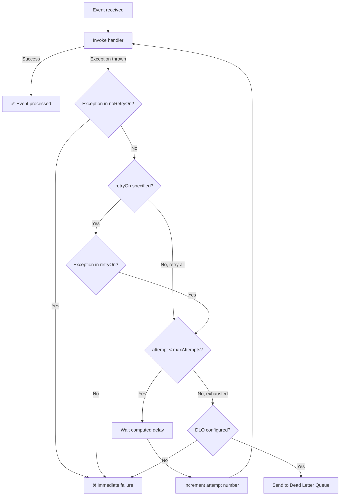

FlowWarden provides two complementary annotations — `@RetryPolicy` and `@DeadLetterQueue` — to handle failures gracefully in Change Stream handlers. Together, they ensure that **transient errors are retried automatically** and **permanent failures are captured** for later investigation instead of being silently lost.

## How Retry Works

When `@RetryPolicy` is placed on a handler class, the framework catches exceptions thrown by the handler and retries the invocation up to `maxAttempts` times with increasing delays between attempts.



A simple example:

```java
@ChangeStream(name = "order-watcher", collection = "orders")
@RetryPolicy
public class OrderStreamHandler {

    @OnChange
    void handle(ChangeStreamContext<Order> ctx) {
        // If this throws, FlowWarden retries up to 3 times
        // with 500ms → 1s → 2s delays (exponential backoff)
        orderService.process(ctx.getFullDocument(Order.class));
    }
}
```

With the default configuration, the handler is retried up to **3 times** with exponential backoff starting at **500ms**, a multiplier of **2.0**, capped at **30s**, and **jitter enabled**.

### Exponential Backoff

The delay between retries is computed using exponential backoff with an optional jitter:

```
baseDelay   = initialDelay × (multiplier ^ (attemptNumber - 1))
cappedDelay = min(baseDelay, maxDelay)

if jitter = true:
    finalDelay = cappedDelay × random(0.8, 1.2)    // ±20%
else:
    finalDelay = cappedDelay
```

For the defaults (`initialDelay = "500ms"`, `multiplier = 2.0`, `maxDelay = "30s"`, `jitter = false`), the delays are:

| Attempt | Delay |
|---------|-------|
| 1 (initial) | — |
| 2 (1st retry) | 500ms |
| 3 (2nd retry) | 1s |
| 4 | 2s |
| 5 | 4s |
| 6 | 8s |
| 7 | 16s |
| 8+ | 30s (capped) |

<Tip>
  Enable `jitter` (the default) in production to prevent **thundering herd** effects when multiple streams retry simultaneously after a shared dependency recovers.
</Tip>

### Exception Filtering

#### Retry Only Specific Exceptions

Use `retryOn` to limit retries to specific exception types. Any other exception causes immediate failure.

```java
@RetryPolicy(
    maxAttempts = 5,
    retryOn = { java.net.SocketTimeoutException.class, MongoTimeoutException.class }
)
```

#### Exclude Specific Exceptions

Use `noRetryOn` to skip retry for specific exceptions. This **overrides** `retryOn` — if an exception matches both, it is **not** retried.

```java
@RetryPolicy(
    maxAttempts = 5,
    noRetryOn = {
        IllegalArgumentException.class,
        NullPointerException.class,
        ClassCastException.class,
        UnsupportedOperationException.class   // add your own
    }
)
```

<Warning>
  `noRetryOn` always takes precedence. If an exception class appears in both `retryOn` and `noRetryOn`, the handler will **not** retry.
</Warning>

### Tracking Retry Attempts

Use `ChangeStreamContext.getAttemptNumber()` to know which attempt is currently running. This is **1-based**: the initial invocation is attempt `1`, the first retry is `2`, and so on.

```java
@OnChange
void handle(ChangeStreamContext<Order> ctx) {
    int attempt = ctx.getAttemptNumber();
    if (attempt > 1) {
        log.warn("Retrying event {} (attempt {})", ctx.getEventId(), attempt);
    }
    orderService.process(ctx.getFullDocument(Order.class));
}
```

## How the Dead Letter Queue Works

When `@DeadLetterQueue` is present on a handler class, events that fail (after all retries are exhausted, if `@RetryPolicy` is also present) are persisted to a dedicated MongoDB collection instead of being silently lost. The stream **continues processing** subsequent events without blocking.

```mermaid
flowchart TD
    A[Event received] --> B[Invoke handler]
    B -->|Success| C[✅ Event processed]
    B -->|Exception| D{@RetryPolicy present?}
    D -->|Yes| E{Retries exhausted?}
    D -->|No| F{@DeadLetterQueue present?}
    E -->|No| G[Retry with backoff]
    G --> B
    E -->|Yes| F
    F -->|Yes| H[Send to DLQ]
    H --> I[✅ Stream continues]
    F -->|No| J[❌ Event lost]
```

A simple example:

```java
@ChangeStream(name = "order-watcher", collection = "orders")
@RetryPolicy(maxAttempts = 3)
@DeadLetterQueue
public class OrderStreamHandler {

    @OnInsert
    void handle(ChangeStreamContext<Order> ctx) {
        orderService.process(ctx.getFullDocument(Order.class));
    }
}
```

With the default configuration, failed events are stored in the `_fw_dlq` collection with a **30-day TTL**, including the original document and full stack trace.

### Automatic DLQ Routing

When all retries are exhausted (or on first failure if no `@RetryPolicy` is present), the event is automatically sent to the DLQ. No extra code is needed — just add the annotation.

### Manual DLQ Routing

You can manually send an event to the DLQ from any handler using `ctx.sendToDlq(reason)`. This is useful when you detect a business-level error that shouldn't be retried.

```java
@OnInsert
void handle(ChangeStreamContext<Order> ctx) {
    Order order = ctx.getFullDocument(Order.class);

    if (order.getTotal() < 0) {
        // Business validation failure — don't retry, send straight to DLQ
        ctx.sendToDlq("Invalid order total: " + order.getTotal());
        return;
    }

    orderService.process(order);
}
```

<Note>
  `sendToDlq()` requires a `DlqStore` bean to be available. The MongoDB implementation (`MongoDlqStore`) is auto-configured when `@DeadLetterQueue` is present on any stream.
</Note>

### DLQ Document Schema

Each failed event is stored as a MongoDB document in the DLQ collection:

<Accordion title="DLQ document structure">

```json
{
  "_id": "550e8400-e29b-41d4-a716-446655440000",
  "streamName": "order-stream",
  "operationType": "INSERT",
  "documentKey": { "_id": "64f1a2b3c4d5e6f7a8b9c0d1" },
  "fullDocument": {
    "_id": "64f1a2b3c4d5e6f7a8b9c0d1",
    "status": "PAID",
    "total": 99.99
  },
  "resumeToken": { ... },
  "error": {
    "type": "java.lang.RuntimeException",
    "message": "Connection refused to payment gateway",
    "stackTrace": "java.lang.RuntimeException: Connection refused..."
  },
  "attempts": 3,
  "status": "PENDING",
  "firstAttemptAt": "2026-01-15T10:30:00Z",
  "lastAttemptAt": "2026-01-15T10:30:05Z",
  "createdAt": "2026-01-15T10:30:05Z",
  "expiresAt": "2026-02-14T10:30:05Z",
  "metadata": {}
}
```

</Accordion>

| Field | Description |
|-------|-------------|
| `streamName` | Name of the originating `@ChangeStream` |
| `operationType` | MongoDB operation (`INSERT`, `UPDATE`, `DELETE`, etc.) |
| `documentKey` | `_id` of the source document |
| `fullDocument` | Original document (if `includeOriginalDocument = true`) |
| `error.type` | Exception class name |
| `error.message` | Exception message |
| `error.stackTrace` | Full stack trace (if `includeStackTrace = true`) |
| `attempts` | Total number of processing attempts (including retries) |
| `status` | Event status (`PENDING`) |
| `expiresAt` | Computed from `createdAt + ttlDays` (`null` if `ttlDays = 0`) |

## Retry + DLQ Together

`@DeadLetterQueue` works with or without `@RetryPolicy`:

| Configuration | Behavior |
|---------------|----------|
| `@RetryPolicy` + `@DeadLetterQueue` | Event is retried up to `maxAttempts` times. If all retries fail, the event is sent to the DLQ. |
| `@DeadLetterQueue` only | Event is sent to the DLQ **immediately** after the first failure. |
| `@RetryPolicy` only | Event is retried, but if all retries fail, the event is **lost**. |
| Neither | Event is lost on first failure. |

<Warning>
  Without `@DeadLetterQueue`, failed events that exhaust all retries are permanently lost. Always pair `@RetryPolicy` with `@DeadLetterQueue` for critical streams.
</Warning>

## Complete Example

<CodeGroup>

```java Imperative
@ChangeStream(
    name = "order-stream",
    collection = "orders",
    documentType = Order.class,
    operationTypes = { OperationType.INSERT, OperationType.UPDATE }
)
@RetryPolicy(maxAttempts = 5, initialDelay = "500ms", multiplier = 2.0)
@DeadLetterQueue(collection = "orders_dlq", ttlDays = 90)
public class OrderStreamHandler {

    @OnInsert
    void onNewOrder(ChangeStreamContext<Order> ctx) {
        Order order = ctx.getFullDocument(Order.class);
        log.info("Processing order {} (attempt {})",
            order.getId(), ctx.getAttemptNumber());
        orderService.process(order);
    }

    @OnError
    ErrorAction onError(Throwable error, ChangeStreamContext<?> ctx) {
        log.error("Order {} failed after {} attempts: {}",
            ctx.getDocumentKey(), ctx.getAttemptNumber(), error.getMessage());
        return ErrorAction.DLQ;
    }
}
```

```java Reactive
@ChangeStream(
    name = "order-stream",
    collection = "orders",
    documentType = Order.class,
    operationTypes = { OperationType.INSERT, OperationType.UPDATE }
)
@RetryPolicy(maxAttempts = 5, initialDelay = "500ms", multiplier = 2.0)
@DeadLetterQueue(collection = "orders_dlq", ttlDays = 90)
public class OrderStreamHandler {

    @OnInsert
    Mono<Void> onNewOrder(ChangeStreamContext<Order> ctx) {
        Order order = ctx.getFullDocument(Order.class);
        log.info("Processing order {} (attempt {})",
            order.getId(), ctx.getAttemptNumber());
        return orderService.processReactive(order);
    }

    @OnError
    ErrorAction onError(Throwable error, ChangeStreamContext<?> ctx) {
        log.error("Order {} failed after {} attempts: {}",
            ctx.getDocumentKey(), ctx.getAttemptNumber(), error.getMessage());
        return ErrorAction.DLQ;
    }
}
```

</CodeGroup>

## Best Practices

- **Always pair `@RetryPolicy` with `@DeadLetterQueue`** for critical streams. Retry handles transient errors; the DLQ captures permanent failures.
- **Keep `maxAttempts` low** (3–5) for synchronous operations. Use the DLQ for reprocessing rather than excessive retries that block the stream.
- **Use `retryOn` to narrow scope** when your handler calls external services — only retry on transient exceptions (timeouts, connection errors), not on validation errors.
- **Leave `jitter = true`** in production to prevent synchronized retry storms when a shared dependency recovers.
- **Monitor `getAttemptNumber()`** in your handlers to add context to logs and metrics on retries.
- **Use `sendToDlq(reason)` for business validation failures** that you know retrying won't fix (e.g., invalid data, missing required fields).
- **Set `ttlDays` based on your investigation SLA.** 30 days is a good default. Use `ttlDays = 0` for regulatory or audit-critical streams.
- **Disable `includeOriginalDocument` for large documents** if storage is a concern. You can always look up the document by `documentKey`.
- **Monitor the `_fw_dlq` collection** — growing DLQ entries indicate a handler issue that needs attention.

<Warning>
  If no `@RetryPolicy` is present and a handler throws, the exception propagates immediately. The event is **not** retried and is lost unless a `@DeadLetterQueue` is configured.
</Warning>

<Tip>
  DLQ events can be viewed and reprocessed via FlowWarden Console. The Core library is intentionally **write-only** for the DLQ — reading and replaying is a Console feature.
</Tip>

## See Also

<CardGroup cols={2}>
  <Card title="@RetryPolicy Reference" icon="rotate-right" href="/reference/retry-policy">
    All attributes, defaults, and YAML configuration for retry
  </Card>
  <Card title="@DeadLetterQueue Reference" icon="box-archive" href="/reference/dead-letter-queue">
    All attributes, DLQ Storage SPI, and YAML configuration
  </Card>
  <Card title="@Checkpoint" icon="bookmark" href="/reference/checkpoint">
    Resume token persistence for reliable stream recovery
  </Card>
  <Card title="ChangeStreamContext" icon="circle-info" href="/reference/change-stream-context">
    Runtime context including sendToDlq(), attempt number, and more
  </Card>
</CardGroup>
