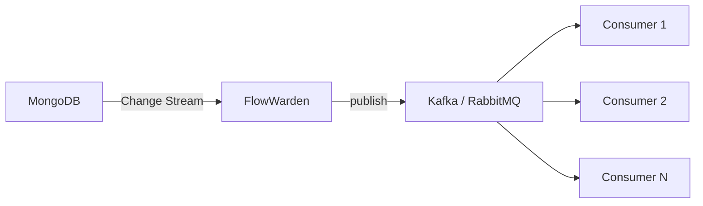

FlowWarden processes Change Stream events **sequentially within each stream** — one event at a time. This is a deliberate design choice that keeps checkpointing simple and guarantees event ordering. This page explains why, when it matters, and how to scale beyond it.

---

## Threading model

### One thread per stream

In **imperative** mode, each `@ChangeStream` runs on its own dedicated thread managed by Spring Data MongoDB's `DefaultMessageListenerContainer`. Events are processed one at a time in order:

```
Stream "orders"   → Thread-1 : event1 → event2 → event3 (sequential)
Stream "payments" → Thread-2 : event1 → event2 → event3 (sequential)
```

In **reactive** mode, the pipeline uses `concatMap` (not `flatMap`), which guarantees sequential processing per stream on Reactor's scheduler threads.

### Why sequential?

Three constraints make sequential processing the natural default:

1. **Checkpoint is a linear cursor** — FlowWarden persists a single resume token per stream. If events were processed out of order, a crash after checkpointing event 3 (but before event 2 completes) would lose event 2 forever.

2. **Event ordering matters** — MongoDB Change Streams deliver events in oplog order. An update to a document should be processed after its insert, not before.

3. **Simplicity** — sequential processing eliminates race conditions, makes handlers easy to reason about, and avoids the need for complex coordination.

### When sequential is enough

For most use cases, sequential processing is not the bottleneck:

- A single handler typically processes **thousands of events per second** — MongoDB's Change Stream delivery is usually the limiting factor, not the handler
- Multiple `@ChangeStream` classes watching different collections run in **parallel** on separate threads
- `@Pipeline` server-side filtering reduces the event volume before it reaches your handler

---

## Virtual threads

Spring Boot 3.2+ supports virtual threads (Project Loom) via `spring.threads.virtual.enabled=true`. FlowWarden is compatible with virtual threads, but there are important considerations.

### What changes with virtual threads

| Component | Uses virtual threads? | Notes |
|-----------|:---------------------:|-------|
| **Handler execution** | Yes | The `DefaultMessageListenerContainer` from Spring Data may use virtual threads for its internal executor |
| **`Thread.sleep()` in retry** | Yes | Runs on the handler's thread — correctly yields the carrier thread |
| **`@Transactional` sessions** | Yes | `TransactionSynchronizationManager` uses `ThreadLocal`, which works correctly with virtual threads |
| **Checkpoint scheduler** | No | FlowWarden uses a dedicated platform thread (`fw-checkpoint-interval`) |
| **Leader election** | No | FlowWarden uses dedicated platform threads (`fw-leader-election`) |

### Avoid `synchronized` on handlers

<Warning>
  Do not use `synchronized` on handler methods when virtual threads are enabled. This causes **thread pinning** — the virtual thread remains attached to its carrier thread during the entire synchronized block, blocking it from running other virtual threads.
</Warning>

```java
// DON'T — causes thread pinning with virtual threads
@OnInsert
synchronized void handle(ChangeStreamContext<?> ctx) {
    mongoTemplate.save(...);  // blocks the carrier thread
}

// DO — use ReentrantLock if you need mutual exclusion
private final ReentrantLock lock = new ReentrantLock();

@OnInsert
void handle(ChangeStreamContext<?> ctx) {
    lock.lock();
    try {
        mongoTemplate.save(...);
    } finally {
        lock.unlock();
    }
}
```

<Note>
  In practice, `synchronized` on a handler is **redundant**: FlowWarden processes events sequentially within a single stream — there is never concurrent access to the same handler for the same stream. If you need cross-stream coordination, use a `ReentrantLock` instead.
</Note>

---

## Scaling with message brokers

When a single stream's sequential throughput is not enough, the recommended pattern is to use FlowWarden as a **reliable CDC consumer** that fans out events to a message broker. The broker handles parallelism natively via partitions (Kafka) or competing consumers (RabbitMQ).



### Why this pattern?

<CardGroup cols={2}>
  <Card title="FlowWarden handles" icon="database">
    - Reliable Change Stream consumption
    - Checkpoint & resume on restart
    - Retry & DLQ for publish failures
    - Leader election (single consumer)
  </Card>
  <Card title="The broker handles" icon="arrow-right-arrow-left">
    - Parallel processing across N consumers
    - Message ordering per partition/key
    - Backpressure and flow control
    - Independent retry per consumer
  </Card>
</CardGroup>

### Example with Kafka

```java
@ChangeStream(
    collection = "orders",
    documentType = Order.class,
    deploymentMode = DeploymentMode.SINGLE_LEADER
)
@Checkpoint(saveEveryN = 1)
@RetryPolicy(maxAttempts = 5)
@DeadLetterQueue
public class OrderToKafka {

    @Autowired
    private KafkaTemplate<String, OrderEvent> kafkaTemplate;

    @OnInsert
    void handle(Order order, ChangeStreamContext<Order> ctx) {
        kafkaTemplate.send(
            "order-events",
            order.getId(),             // partition key = order ID
            OrderEvent.from(order)     // event payload
        ).get();  // block until ack — ensures at-least-once to Kafka
    }
}
```

Kafka consumers then process events in parallel, one consumer per partition:

```java
@KafkaListener(topics = "order-events", groupId = "order-processing")
void process(OrderEvent event) {
    // Heavy processing happens here — in parallel across partitions
    orderService.fulfill(event);
}
```

### Example with RabbitMQ

```java
@ChangeStream(
    collection = "orders",
    documentType = Order.class,
    deploymentMode = DeploymentMode.SINGLE_LEADER
)
@Checkpoint(saveEveryN = 1)
@RetryPolicy(maxAttempts = 5)
@DeadLetterQueue
public class OrderToRabbit {

    @Autowired
    private RabbitTemplate rabbitTemplate;

    @OnInsert
    void handle(Order order, ChangeStreamContext<Order> ctx) {
        rabbitTemplate.convertAndSend(
            "order-exchange",
            "order.created",
            OrderEvent.from(order)
        );
    }
}
```

RabbitMQ consumers compete for messages, enabling parallel processing:

```java
@RabbitListener(queues = "order-processing")
void process(OrderEvent event) {
    orderService.fulfill(event);
}
```

### Design considerations

| Concern | Recommendation |
|---------|---------------|
| **Ordering** | Use the document `_id` or a business key as the Kafka partition key — events for the same entity stay ordered |
| **Idempotency** | Broker consumers must be idempotent — FlowWarden guarantees at-least-once to the broker, and the broker guarantees at-least-once to consumers |
| **Deployment mode** | Use `SINGLE_LEADER` on the FlowWarden stream to avoid publishing duplicate events from multiple instances |
| **Publish failures** | FlowWarden's `@RetryPolicy` + `@DeadLetterQueue` handle transient broker failures — if the publish fails after all retries, the event lands in FlowWarden's DLQ |
| **Backpressure** | The broker absorbs bursts — FlowWarden publishes at Change Stream speed, consumers process at their own pace |
