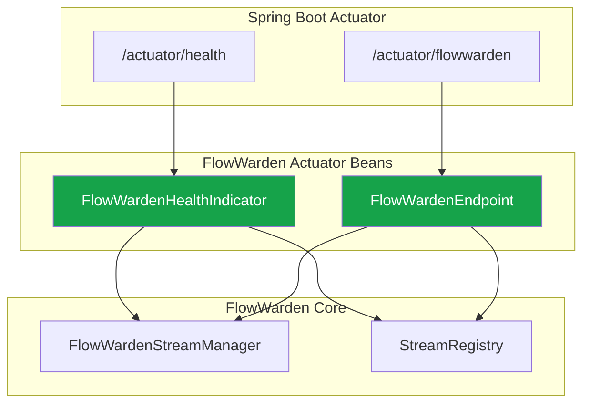

FlowWarden integrates with [Spring Boot Actuator](https://docs.spring.io/spring-boot/docs/current/reference/html/actuator.html) to expose stream health and a management endpoint. This is auto-configured when `spring-boot-starter-actuator` is on the classpath.

## Prerequisites

Add the Actuator starter to your project:

<CodeGroup>
```xml Maven
<dependency>
    <groupId>org.springframework.boot</groupId>
    <artifactId>spring-boot-starter-actuator</artifactId>
</dependency>
```

```groovy Gradle
implementation 'org.springframework.boot:spring-boot-starter-actuator'
```
</CodeGroup>

No additional FlowWarden configuration is needed — `FlowWardenActuatorAutoConfiguration` activates automatically via `@ConditionalOnClass(Endpoint.class)`.

## Health Indicator

FlowWarden contributes a `flowWarden` component to `/actuator/health`:

```json
{
  "status": "UP",
  "components": {
    "flowWarden": {
      "status": "UP",
      "details": {
        "streams": 3,
        "healthy": 3
      }
    }
  }
}
```

### Health Logic

The health indicator considers only streams that are both **enabled** and **autoStart**:

| Condition | Status |
|-----------|--------|
| All enabled + autoStart streams are running | `UP` |
| At least one enabled + autoStart stream is stopped | `DOWN` |
| No streams registered | `UP` |
| Stream is disabled (`enabled = false`) | Not counted |
| Stream has `autoStart = false` | Not counted |

<Note>
  Streams with `autoStart = false` are excluded from health checks because they are expected to be started manually or by the FlowWarden Console.
</Note>

### Configuration

To see health details, configure Actuator:

```yaml application.yml
management:
  endpoint:
    health:
      show-details: always  # or "when-authorized"
  endpoints:
    web:
      exposure:
        include: health, flowwarden
```

## Custom Endpoint

FlowWarden exposes a dedicated endpoint at `/actuator/flowwarden`.

### GET /actuator/flowwarden

Returns the status of all registered streams with detailed information per stream:

```json
{
  "streams": {
    "order-stream": {
      "status": "UP",
      "mode": "SINGLE_LEADER",
      "lastEventTime": "2024-01-15T10:35:45.123Z"
    },
    "analytics-stream": {
      "status": "UP",
      "mode": "ALL_INSTANCES",
      "lastEventTime": null
    },
    "legacy-stream": {
      "status": "DOWN",
      "mode": "SINGLE_LEADER",
      "lastEventTime": "2024-01-15T09:12:03.456Z"
    }
  },
  "healthy": false
}
```

| Field | Type | Description |
|-------|------|-------------|
| `streams` | `Map<String, Object>` | Each stream name mapped to its status object |
| `streams.*.status` | `String` | `"UP"` if the stream is running, `"DOWN"` otherwise |
| `streams.*.mode` | `String` | Deployment mode: `ALL_INSTANCES`, `SINGLE_LEADER`, or `PARTITIONED` |
| `streams.*.lastEventTime` | `String?` | ISO-8601 timestamp of the last processed event, or `null` if no event has been received yet |
| `healthy` | `boolean` | `true` if all enabled + autoStart streams are running |

<Tip>
  Use the `healthy` field for Kubernetes readiness probes or load balancer health checks.
</Tip>

### Lifecycle Actions

FlowWarden provides three lifecycle actions via POST requests:

| Endpoint | Action | Description |
|----------|--------|-------------|
| `POST /actuator/flowwarden/{streamName}/stop` | `stopped` | Stops a running stream |
| `POST /actuator/flowwarden/{streamName}/start` | `started` | Starts a stopped stream |
| `POST /actuator/flowwarden/{streamName}/restart` | `restarted` | Stops and restarts a stream |

#### Stop a stream

```bash
curl -X POST http://localhost:8080/actuator/flowwarden/order-stream/stop
```

```json
{
  "stream": "order-stream",
  "action": "stopped",
  "running": false
}
```

#### Start a stream

```bash
curl -X POST http://localhost:8080/actuator/flowwarden/order-stream/start
```

```json
{
  "stream": "order-stream",
  "action": "started",
  "running": true
}
```

#### Restart a stream

```bash
curl -X POST http://localhost:8080/actuator/flowwarden/order-stream/restart
```

```json
{
  "stream": "order-stream",
  "action": "restarted",
  "running": true
}
```

<Warning>
  Lifecycle actions take effect immediately. Use with caution in production — stopping a stream means events will be queued in MongoDB until the stream is restarted. Checkpoint ensures no events are lost on restart.
</Warning>

Attempting an unsupported action returns an error:

```json
{
  "stream": "order-stream",
  "error": "Unsupported action 'pause'. Available actions: stop, start, restart."
}
```

## Architecture



## Auto-Configuration

`FlowWardenActuatorAutoConfiguration` registers two beans:

| Bean | Class | Purpose |
|------|-------|---------|
| `flowWardenEndpoint` | `FlowWardenEndpoint` | Custom `/actuator/flowwarden` endpoint |
| `flowWardenHealthIndicator` | `FlowWardenHealthIndicator` | Health contributor to `/actuator/health` |

The auto-configuration is conditional:
- Requires `spring-boot-actuator` on the classpath (`@ConditionalOnClass(Endpoint.class)`)
- Loads **after** `FlowWardenAutoConfiguration` to ensure `FlowWardenStreamManager` and `StreamRegistry` are available

## Kubernetes Integration

### Readiness Probe

Use the health endpoint as a readiness probe to prevent traffic from reaching an instance with unhealthy streams:

```yaml deployment.yml
readinessProbe:
  httpGet:
    path: /actuator/health
    port: 8080
  initialDelaySeconds: 15
  periodSeconds: 10
```

### Liveness Probe

For liveness, you can use the dedicated FlowWarden endpoint:

```yaml deployment.yml
livenessProbe:
  httpGet:
    path: /actuator/flowwarden
    port: 8080
  initialDelaySeconds: 30
  periodSeconds: 15
```

<Accordion title="Full Kubernetes Deployment Example">
```yaml
apiVersion: apps/v1
kind: Deployment
metadata:
  name: my-service
spec:
  template:
    spec:
      containers:
        - name: app
          image: my-service:latest
          ports:
            - containerPort: 8080
          readinessProbe:
            httpGet:
              path: /actuator/health
              port: 8080
            initialDelaySeconds: 15
            periodSeconds: 10
          livenessProbe:
            httpGet:
              path: /actuator/flowwarden
              port: 8080
            initialDelaySeconds: 30
            periodSeconds: 15
          env:
            - name: MANAGEMENT_ENDPOINTS_WEB_EXPOSURE_INCLUDE
              value: "health,flowwarden"
            - name: MANAGEMENT_ENDPOINT_HEALTH_SHOW_DETAILS
              value: "always"
```
</Accordion>

## Best Practices

- **Expose only what you need** — limit `management.endpoints.web.exposure.include` to `health,flowwarden` in production
- **Secure endpoints** — use Spring Security to restrict access to management endpoints
- **Use `healthy` for probes** — the `healthy` field in the FlowWarden endpoint is a single boolean suitable for automated checks
- **Emergency stop only** — the `stop` action is for emergency situations; use the FlowWarden Console for routine lifecycle management

## See Also

<CardGroup cols={2}>
  <Card title="@ChangeStream" icon="bolt" href="/reference/change-stream">
    Stream registration and configuration
  </Card>
  <Card title="Configuration" icon="gear" href="/reference/configuration">
    YAML properties reference
  </Card>
</CardGroup>
