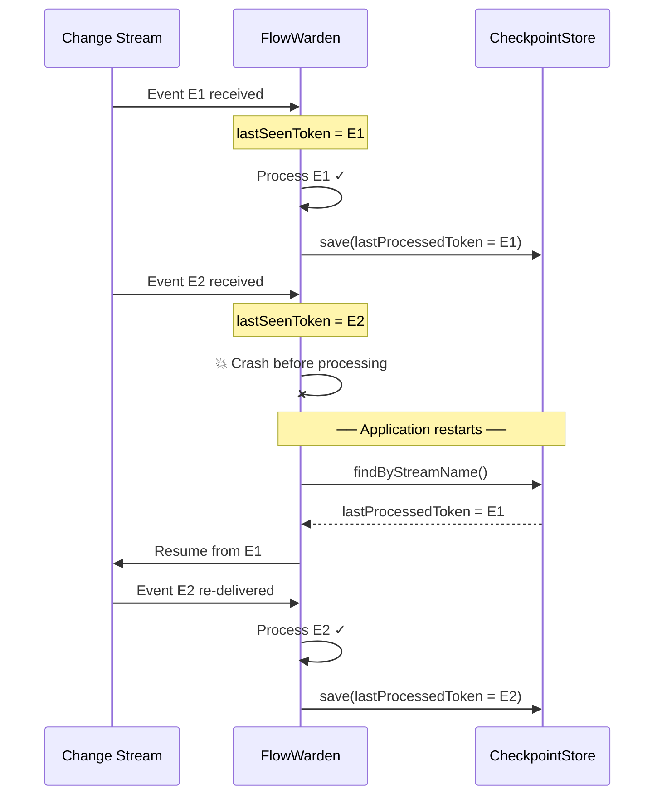

The `@Checkpoint` annotation enables **automatic persistence of MongoDB Change Stream resume tokens**. When placed on a class alongside `@ChangeStream`, the framework saves the resume token after processing events and restores it on restart — so your stream picks up exactly where it left off.

## Basic Usage

```java
@ChangeStream(name = "order-watcher", collection = "orders")
@Checkpoint
public class OrderStreamHandler {

    @OnInsert
    void handle(ChangeStreamContext<Order> ctx) {
        System.out.println(ctx.summary());
    }
}
```

With the default configuration, a checkpoint is saved **after every event** and the stream resumes from the last processed token on restart.

## Attributes

| Attribute | Type | Default | Description |
|-----------|------|---------|-------------|
| `strategy` | `CheckpointStrategy` | `MONGODB` | Storage backend for checkpoints |
| `saveEveryN` | `int` | `1` | Save a checkpoint every N successfully processed events |
| `saveIntervalSeconds` | `int` | `5` | Periodic checkpoint interval in seconds (heartbeat). Set to `0` to disable |
| `startPosition` | `StartPosition` | `RESUME` | Where to start consuming when the stream starts |

<Note>
  Checkpoints are stored in the `_fw_checkpoints` collection in your MongoDB database.
</Note>

### `strategy`

Determines where checkpoints are persisted. Currently, only `MONGODB` is available.

| Strategy | Description |
|----------|-------------|
| `MONGODB` | Dedicated MongoDB collection (default, recommended) |

### `saveEveryN`

Controls how often checkpoints are saved based on event count. Setting this to a higher value reduces write pressure on MongoDB at the cost of potentially replaying more events after a crash.

```java
// Save every 10 events instead of every event
@Checkpoint(saveEveryN = 10)
```

### `saveIntervalSeconds`

A periodic timer that saves the latest resume token at the specified interval, **even when no events are arriving**. This acts as a heartbeat, ensuring the checkpoint stays fresh for idle streams.

```java
// Save every 30 seconds
@Checkpoint(saveIntervalSeconds = 30)

// Disable periodic saving (only save based on saveEveryN)
@Checkpoint(saveIntervalSeconds = 0)
```

### `startPosition`

Determines where the stream starts consuming when it is first created or when no checkpoint exists.

| Value | Description |
|-------|-------------|
| `RESUME` | Resume from the last persisted checkpoint. If no checkpoint exists, starts from the latest event. **(default)** |
| `LATEST` | Ignore any existing checkpoint and start from the latest event. |

## Comprehensive Example

<CodeGroup>

```java Imperative
@ChangeStream(name = "order-stream", collection = "orders", documentType = Order.class)
@Checkpoint(strategy = CheckpointStrategy.MONGODB, saveEveryN = 5,
        saveIntervalSeconds = 10, startPosition = StartPosition.LATEST)
public class OrderStreamHandler {

    @OnInsert
    void handle(ChangeStreamContext<Order> ctx) {
        Order order = ctx.getFullDocument(Order.class);
        log.info("New order: {}", order.getId());
    }
}
```

```java Reactive
@ChangeStream(name = "order-stream", collection = "orders", documentType = Order.class)
@Checkpoint(strategy = CheckpointStrategy.MONGODB, saveEveryN = 5,
        saveIntervalSeconds = 10, startPosition = StartPosition.LATEST)
public class OrderStreamHandler {

    @OnInsert
    Mono<Void> handle(ChangeStreamContext<Order> ctx) {
        Order order = ctx.getFullDocument(Order.class);
        log.info("New order: {}", order.getId());
        return Mono.empty();
    }
}
```

</CodeGroup>

## How It Works

FlowWarden uses a **dual-token checkpoint** model internally:

| Token | Description |
|-------|-------------|
| `lastSeenToken` | Resume token of the last event **received** from MongoDB |
| `lastProcessedToken` | Resume token of the last event **successfully handled** |

This distinction enables **at-least-once delivery guarantees**: if the application crashes after receiving an event but before processing it, the stream resumes from `lastProcessedToken`, ensuring the event is re-delivered.



## Checkpoint Storage (SPI)

The `CheckpointStore` interface is the SPI that backs `@Checkpoint`. The MongoDB implementation is auto-configured, but you can provide your own by registering a `CheckpointStore` bean:

```java
public interface CheckpointStore {
    void save(Checkpoint checkpoint);
    Optional<Checkpoint> findByStreamName(String streamName);
    void delete(String streamName);
}
```

<Accordion title="Checkpoint record structure">

```java
public record Checkpoint(
    String streamName,
    String instanceId,
    BsonDocument lastSeenToken,
    Instant lastSeenTimestamp,
    BsonDocument lastProcessedToken,
    Instant lastProcessedTimestamp,
    String filterHash,
    Map<String, Object> metadata
) {}
```

</Accordion>

## Configuration

Checkpoint behavior is configured per stream via the `@Checkpoint` annotation attributes.
There is no YAML/properties equivalent — this is by design to keep configuration co-located
with the handler code.

## Best Practices

- **Keep `saveEveryN = 1` for critical streams** (e.g., order processing, billing) to minimize event replay on crash.
- **Increase `saveEveryN` for high-throughput streams** where replaying a few events is acceptable — this reduces checkpoint write pressure.
- **Do not disable `saveIntervalSeconds`** unless you have a specific reason. The heartbeat checkpoint ensures idle streams stay recoverable.
- **Use `startPosition = LATEST`** only for streams where historical events are irrelevant (e.g., cache invalidation).

<Warning>
  MongoDB **must** be configured as a Replica Set for Change Streams (and therefore checkpointing) to work. This applies to development environments as well. Testcontainers automatically provisions a single-node Replica Set for testing.
</Warning>

## Roadmap

The following attributes are planned but not yet implemented:

| Attribute | Description | Status |
|-----------|-------------|--------|
| `collection` | Custom collection name for checkpoint storage | TODO |
| `dualCheckpoint` | Toggle dual-token checkpointing on/off | TODO |
| `startAtTimestamp` | Start consuming from a specific ISO-8601 timestamp | TODO |

## See Also

<CardGroup cols={2}>
  <Card title="Checkpoint & Resume Guide" icon="map" href="/guides/checkpoint-resume">
    Step-by-step guide to configuring checkpoint and resume behavior
  </Card>
  <Card title="@ChangeStream" icon="database" href="/reference/change-stream">
    The main annotation for declaring Change Stream handlers
  </Card>
  <Card title="@RetryPolicy" icon="rotate" href="/reference/retry-policy">
    Configure retry behavior for failed event processing
  </Card>
  <Card title="Configuration" icon="gear" href="/reference/configuration">
    Full YAML configuration reference and resolution hierarchy
  </Card>
</CardGroup>
