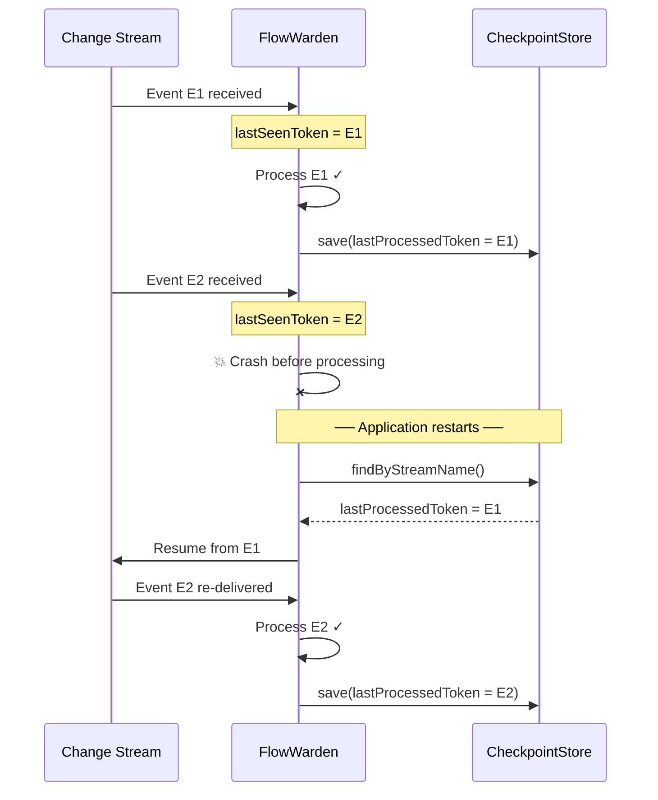

The `@Checkpoint` annotation enables **automatic persistence of MongoDB Change Stream resume tokens**. When placed on a class alongside `@ChangeStream`, the framework saves the resume token after processing events and restores it on restart — so your stream picks up exactly where it left off.

## Basic Usage

```java
@ChangeStream(name = "order-watcher", collection = "orders")
@Checkpoint
public class OrderStreamHandler {

    @OnInsert
    void handle(ChangeStreamContext<Order> ctx) {
        System.out.println(ctx.summary());
    }
}
```

With the default configuration, a checkpoint is saved **after every event** and the stream resumes from the last processed token on restart.

## Attributes

| Attribute | Type | Default | Description |
|-----------|------|---------|-------------|
| `saveEveryN` | `int` | `1` | Save a checkpoint every N successfully processed events |
| `saveIntervalSeconds` | `int` | `5` | Periodic checkpoint interval in seconds (heartbeat). Set to `0` to disable |
| `startPosition` | `StartPosition` | `RESUME` | Where to start consuming when the stream starts |
| `onHistoryLost` | `OnHistoryLost` | `FAIL` | Strategy when the saved resume token has expired from the oplog |

<Note>
  Checkpoints are stored in the `_fw_checkpoints` collection in your MongoDB database. The collection name is not configurable.
</Note>

### `saveEveryN`

Controls how often checkpoints are saved based on event count. Setting this to a higher value reduces write pressure on MongoDB at the cost of potentially replaying more events after a crash.

```java
// Save every 10 events instead of every event
@Checkpoint(saveEveryN = 10)
```

### `saveIntervalSeconds`

A periodic timer that saves the latest resume token at the specified interval, **even when no events are arriving**. This acts as a heartbeat, ensuring the checkpoint stays fresh for idle streams.

```java
// Save every 30 seconds
@Checkpoint(saveIntervalSeconds = 30)

// Disable periodic saving (only save based on saveEveryN)
@Checkpoint(saveIntervalSeconds = 0)
```

### `startPosition`

Determines where the stream starts consuming when it is first created or when no checkpoint exists.

| Value | Description |
|-------|-------------|
| `RESUME` | Resume from the last persisted checkpoint. If no checkpoint exists, starts from the latest event. **(default)** |
| `LATEST` | Ignore any existing checkpoint and start from the latest event. |

### `onHistoryLost`

Determines the recovery strategy when the saved resume token has expired from the MongoDB oplog. This happens when a stream is stopped for longer than the oplog retention window.

| Strategy | Events in gap | Behavior |
|----------|---------------|----------|
| `FAIL` | Unknown | Stream refuses to start. Throws `HistoryLostException`. Operator must intervene. **(default)** |
| `RESUME_FROM_OPLOG_START` | Partially lost | Resumes from the oldest available oplog entry. Falls back to `RESUME_FROM_NOW` if the oplog is inaccessible. |
| `RESUME_FROM_NOW` | All lost | Starts from the current moment. The entire gap is skipped — no replay. |

```java
// Default: fail loudly — operator must decide
@Checkpoint(onHistoryLost = OnHistoryLost.FAIL)

// Resume from oldest available oplog entry (partial recovery)
@Checkpoint(onHistoryLost = OnHistoryLost.RESUME_FROM_OPLOG_START)

// Skip gap entirely — for streams where missing events is acceptable
@Checkpoint(onHistoryLost = OnHistoryLost.RESUME_FROM_NOW)
```

<Warning>
  `FAIL` is the default because **silent data loss is worse than a stream that refuses to start**. Only use `RESUME_FROM_NOW` or `RESUME_FROM_OPLOG_START` for streams where missing events is acceptable (e.g., cache invalidation, non-critical notifications).
</Warning>

<Accordion title="HistoryLostException">

When `onHistoryLost = FAIL`, the framework throws a `HistoryLostException` with an actionable message:

```java
public class HistoryLostException extends RuntimeException {
    public String getStreamName();
    public Instant getLastCheckpointTimestamp();
}
```

The exception message includes the stream name, the last checkpoint timestamp, and suggestions for recovery strategies.

</Accordion>

## Comprehensive Example

<CodeGroup>

```java Imperative
@ChangeStream(name = "order-stream", collection = "orders", documentType = Order.class)
@Checkpoint(saveEveryN = 5, saveIntervalSeconds = 10, startPosition = StartPosition.LATEST)
public class OrderStreamHandler {

    @OnInsert
    void handle(ChangeStreamContext<Order> ctx) {
        Order order = ctx.getFullDocument(Order.class);
        log.info("New order: {}", order.getId());
    }
}
```

```java Reactive
@ChangeStream(name = "order-stream", collection = "orders", documentType = Order.class)
@Checkpoint(saveEveryN = 5, saveIntervalSeconds = 10, startPosition = StartPosition.LATEST)
public class OrderStreamHandler {

    @OnInsert
    Mono<Void> handle(ChangeStreamContext<Order> ctx) {
        Order order = ctx.getFullDocument(Order.class);
        log.info("New order: {}", order.getId());
        return Mono.empty();
    }
}
```

</CodeGroup>

## How It Works

FlowWarden uses a **dual-token checkpoint** model internally:

| Token | Description |
|-------|-------------|
| `lastSeenToken` | Resume token of the last event **received** from MongoDB |
| `lastProcessedToken` | Resume token of the last event **successfully handled** |

This distinction enables **at-least-once delivery guarantees**: if the application crashes after receiving an event but before processing it, the stream resumes from `lastProcessedToken`, ensuring the event is re-delivered.


```mermaid
sequenceDiagram
    participant CS as Change Stream
    participant FW as FlowWarden
    participant CP as CheckpointStore

    CS->>FW: Event E1 received
    Note over FW: lastSeenToken = E1
    FW->>FW: Process E1 ✓
    FW->>CP: save(lastProcessedToken = E1)

    CS->>FW: Event E2 received
    Note over FW: lastSeenToken = E2
    FW-xFW: 💥 Crash before processing

    Note over FW,CP: ── Application restarts ──

    FW->>CP: findByStreamName()
    CP-->>FW: lastProcessedToken = E1
    FW->>CS: Resume from E1

    CS->>FW: Event E2 re-delivered
    FW->>FW: Process E2 ✓
    FW->>CP: save(lastProcessedToken = E2)
```

<Accordion title="Interaction with @Pipeline">

When a `@Pipeline` is present, it filters events server-side, creating a gap between the actual oplog position and the last event your handler processed. The `lastSeenToken` tracks the oplog position independently (via periodic sampling), so on restart, MongoDB resumes from the most recent position — not from the last processed event.

Without this mechanism, a restart would force MongoDB to re-scan the entire oplog from `lastProcessedToken`, potentially scanning tens of thousands of filtered-out events.

See the [@Pipeline reference](/reference/pipeline#checkpoint-interaction) for details.

</Accordion>

## Checkpoint Storage (SPI)

The `CheckpointStore` interface is the SPI that backs `@Checkpoint`. The MongoDB implementation is auto-configured, but you can provide your own by registering a `CheckpointStore` bean:

```java
public interface CheckpointStore {
    void save(Checkpoint checkpoint);
    Optional<Checkpoint> findByStreamName(String streamName);
    void delete(String streamName);

    /** Returns a shared no-op implementation that silently ignores all calls. */
    static CheckpointStore noOp();
}
```

The framework ships with two auto-configured implementations:

| Implementation | When active |
|----------------|-------------|
| `MongoCheckpointStore` | Imperative mode (`flowwarden.default-mode=IMPERATIVE`) |
| `ReactiveMongoCheckpointStore` | Reactive mode (`flowwarden.default-mode=REACTIVE`) |

Both store checkpoints in the same `_fw_checkpoints` collection with the same document format, so switching between imperative and reactive mode is transparent.

<Accordion title="Checkpoint record structure">

```java
public record Checkpoint(
    String streamName,
    String instanceId,              // nullable
    BsonDocument lastSeenToken,     // nullable
    Instant lastSeenTimestamp,      // nullable
    BsonDocument lastProcessedToken,// nullable
    Instant lastProcessedTimestamp, // nullable
    Map<String, Object> metadata
) {}
```

</Accordion>

## Best Practices

- **Keep `saveEveryN = 1` for critical streams** (e.g., order processing, billing) to minimize event replay on crash.
- **Increase `saveEveryN` for high-throughput streams** where replaying a few events is acceptable — this reduces checkpoint write pressure.
- **Do not disable `saveIntervalSeconds`** unless you have a specific reason. The heartbeat checkpoint ensures idle streams stay recoverable.
- **Use `startPosition = LATEST`** only for streams where historical events are irrelevant (e.g., cache invalidation).

<Warning>
  MongoDB **must** be configured as a Replica Set for Change Streams (and therefore checkpointing) to work. This applies to development environments as well. Testcontainers automatically provisions a single-node Replica Set for testing.
</Warning>

## See Also

<CardGroup cols={2}>
  <Card title="Checkpoint & Resume Guide" icon="map" href="/guides/checkpoint-resume">
    Step-by-step guide to configuring checkpoint and resume behavior
  </Card>
  <Card title="@ChangeStream" icon="database" href="/reference/change-stream">
    The main annotation for declaring Change Stream handlers
  </Card>
  <Card title="@Pipeline" icon="diagram-project" href="/reference/pipeline">
    Server-side filtering and its interaction with dual-token checkpointing
  </Card>
  <Card title="@RetryPolicy" icon="rotate" href="/reference/retry-policy">
    Configure retry behavior for failed event processing
  </Card>
</CardGroup>
