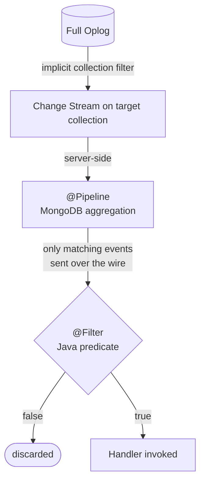

`@Pipeline` defines a **server-side aggregation pipeline** sent to MongoDB when the Change Stream starts. Only matching events are transmitted over the network, reducing traffic and application load.

The pipeline is evaluated **once at stream startup** — not per event.

## Basic Usage

Annotate a method in your `@ChangeStream` class. At most **one** `@Pipeline` method per class. The method must take no parameters.

```java
@ChangeStream(collection = "orders")
public class OrderHandler {

    @Pipeline
    List<Bson> pipeline() {
        return List.of(
            Aggregates.match(Filters.in("fullDocument.status", "PAID", "SHIPPED", "CANCELLED"))
        );
    }

    @OnInsert
    void handle(ChangeStreamContext<Order> ctx) {
        // only receives events where status is PAID, SHIPPED, or CANCELLED
    }
}
```

## Supported Return Types

| Return type | Description |
|-------------|-------------|
| `List<Bson>` | Raw MongoDB BSON pipeline stages |
| `List<AggregationOperation>` | Spring Data aggregation operations |
| `Aggregation` | Spring Data `Aggregation` object |

<CodeGroup>

```java List<Bson>
// From PipelineBsonCapture sample
@Pipeline
List<Bson> pipeline() {
    return List.of(
        Aggregates.match(Filters.in("operationType", "insert", "update"))
    );
}
```

```java Aggregation
// From OrderStreamWithPipeline sample
@Pipeline
Aggregation filterHighValueOrders() {
    return Aggregation.newAggregation(
        Aggregation.match(Criteria.where("fullDocument.total").gt(100))
    );
}
```

```java List<AggregationOperation>
@Pipeline
List<AggregationOperation> pipeline() {
    return List.of(
        Aggregation.match(Criteria.where("operationType").in("insert", "update"))
    );
}
```

</CodeGroup>

## Combining with @Filter

`@Pipeline` can coexist with [`@Filter`](/reference/filter) on the same `@ChangeStream`, forming a **double funnel** — pre-filter server-side, then refine with Java logic:



The following example is from the `PipelineFilterCapture` sample — it pre-filters by operation type server-side, then checks the order status application-side:

```java
@ChangeStream(documentType = Order.class, fullDocument = FullDocumentMode.UPDATE_LOOKUP)
public class PipelineFilterCapture {

    @Pipeline
    Aggregation pipeline() {
        return Aggregation.newAggregation(
            Aggregation.match(Criteria.where("operationType").in("insert", "update"))
        );
    }

    @Filter
    Predicate<ChangeStreamContext<?>> filter() {
        return ctx -> ((ChangeStreamContext<Order>) ctx).getFullDocument(Order.class)
            .map(order -> "CONFIRMED".equals(order.getStatus()))
            .orElse(false);
    }

    @OnInsert
    void onInsert(Order doc, ChangeStreamContext<Order> ctx) { ... }
}
```

<Tip>
Use `@Pipeline` to eliminate events you **never** need (reduce network traffic), then `@Filter` for logic that requires Spring beans, external service calls, or dynamic conditions.
</Tip>

## Checkpoint Interaction

<Warning>
When `@Pipeline` is present, **`dualCheckpoint=true` (the default) is essential** for fast restart.

The pipeline filters events server-side, creating a gap between the oplog position and the last event your handler processed (`lastProcessedToken`). Without dual checkpoint, a restart forces MongoDB to re-scan the entire oplog from `lastProcessedToken` — potentially tens of thousands of filtered events.

With `dualCheckpoint=true`, FlowWarden maintains a separate `lastSeenToken` (advanced via oplog sampling every 5 seconds) that tracks the actual oplog position, regardless of which events matched the pipeline.

A warning is logged at startup if `@Pipeline` is present with `dualCheckpoint=false`.
</Warning>

## Oplog Internals and Limitations

<Accordion title="How Change Stream pipelines interact with the oplog">

### Change Streams Cannot Use Indexes

MongoDB does not support creating indexes on the oplog. All Change Stream pipelines perform a sequential scan (COLLSCAN) of the oplog to evaluate your `$match` filters. This is a fundamental MongoDB limitation, not a FlowWarden one.

### Pushdown-Eligible Fields

Not all filters are equal. Through empirical testing by the MongoDB community (this is **not officially documented** by MongoDB), only a handful of fields allow an optimized evaluation in the oplog scan:

| Field | Pushdown |
|-------|----------|
| `operationType` | Yes |
| `ns.db` | Yes |
| `ns.coll` | Yes |
| `documentKey._id` | Yes |
| `fullDocument.*` | **No** — forces full deserialization |
| `updateDescription.*` | **No** — forces full deserialization |
| Computed or nested fields | **No** — forces full deserialization |

<Warning>
Filtering on `fullDocument` fields (like `fullDocument.status`) forces MongoDB to deserialize and evaluate every oplog entry. This matters most during **restarts**, when MongoDB must scan the oplog forward from the resume token.
</Warning>

### Best Practice: Layer Your Filters

Put pushdown-eligible filters **first** in your pipeline to reduce the number of entries that require full deserialization:

```java
@Pipeline
List<Bson> pipeline() {
    return List.of(
        // Stage 1: pushdown-eligible — fast
        Aggregates.match(Filters.in("operationType", "insert", "update")),
        // Stage 2: requires deserialization — but fewer entries reach this stage
        Aggregates.match(Filters.eq("fullDocument.status", "PAID"))
    );
}
```

### Performance Characteristics

- **Normal operation:** No performance concern. MongoDB evaluates the pipeline on each new oplog entry as it arrives — there is no bulk scan of historical data.
- **At restart:** MongoDB scans the oplog from the resume token forward. If the pipeline filters out most events, this scan can be slow — this is why `dualCheckpoint=true` exists.
- **Oplog retention:** The oplog is a capped collection with a fixed size. If the application is down longer than the oplog retention window, the resume token expires and the stream cannot resume. Use `@Checkpoint(onHistoryLost = ...)` to handle this case.

</Accordion>

<Accordion title="Allowed aggregation stages in Change Stream pipelines">

MongoDB restricts which aggregation stages can be used in a Change Stream pipeline:

| Stage | Allowed |
|-------|---------|
| `$match` | Yes |
| `$project` / `$addFields` | Yes |
| `$replaceRoot` / `$replaceWith` | Yes |
| `$redact` | Yes |
| `$set` / `$unset` | Yes |
| `$group` | **No** |
| `$sort` | **No** |
| `$limit` / `$skip` | **No** |
| `$lookup` | **No** |
| `$out` / `$merge` | **No** |

Using an unsupported stage causes a MongoDB error at stream startup (fail-fast).

</Accordion>

## Constraints

| Constraint | Detail |
|-----------|--------|
| One per class | At most one `@Pipeline` method per `@ChangeStream` class |
| No parameters | The method must take zero arguments |
| Evaluated once | The pipeline is resolved at stream startup, not per event |
| Immutable | Changing the pipeline requires restarting the stream |

## See Also

<CardGroup cols={2}>
  <Card title="@Filter" icon="filter" href="/reference/filter">
    Application-side Java predicate filtering
  </Card>
  <Card title="Filtering Events" icon="arrows-down-to-line" href="/guides/filtering-events">
    When to use @Pipeline vs @Filter
  </Card>
  <Card title="Checkpoint & Resume" icon="bookmark" href="/guides/checkpoint-resume">
    How dual checkpoint interacts with @Pipeline
  </Card>
  <Card title="How it Works" icon="gears" href="/concepts/how-it-works">
    Full event processing pipeline architecture
  </Card>
</CardGroup>
