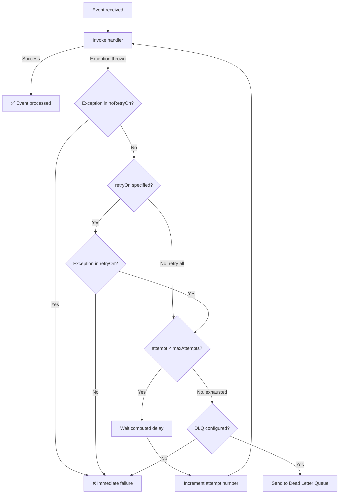

The `@RetryPolicy` annotation enables **automatic retry with exponential backoff** for failed handler invocations. When placed on a class alongside `@ChangeStream`, the framework retries the handler up to `maxAttempts` times with increasing delays between attempts — so transient errors like network blips or temporary service unavailability are handled gracefully.

## Basic Usage

```java
@ChangeStream(name = "order-watcher", collection = "orders")
@RetryPolicy
public class OrderStreamHandler {

    @OnChange
    void handle(ChangeStreamContext<Order> ctx) {
        // If this throws, FlowWarden retries up to 3 times
        // with 500ms → 1s → 2s delays (exponential backoff)
        orderService.process(ctx.getFullDocument(Order.class));
    }
}
```

With the default configuration, the handler is retried up to **3 times** with exponential backoff starting at **500ms**, a multiplier of **2.0**, capped at **30s**, and **jitter enabled**.

## Attributes

| Attribute | Type | Default | Description |
|-----------|------|---------|-------------|
| `maxAttempts` | `int` | `3` | Maximum number of attempts (including the initial one) |
| `initialDelay` | `String` | `"500ms"` | Delay before the first retry. Supports `"500ms"`, `"1s"`, `"1m"` format |
| `maxDelay` | `String` | `"30s"` | Maximum delay cap |
| `multiplier` | `double` | `2.0` | Multiplier applied to the delay between each retry |
| `retryOn` | `Class<? extends Throwable>[]` | `{}` | Exception types that trigger a retry. Empty = all exceptions (except `noRetryOn`) |
| `noRetryOn` | `Class<? extends Throwable>[]` | See below | Exception types that should **never** trigger a retry |
| `jitter` | `boolean` | `true` | Adds random variation (±20%) to the computed delay |

<Note>
  `maxAttempts` includes the initial invocation. So `maxAttempts = 3` means **1 initial attempt + 2 retries**.
</Note>

### `noRetryOn` Defaults

By default, the following exceptions skip retry entirely — they are considered **programming errors** that retrying won't fix:

- `IllegalArgumentException`
- `NullPointerException`
- `ClassCastException`

`noRetryOn` always **takes precedence** over `retryOn`.

## Backoff Algorithm

The delay between retries is computed using exponential backoff with an optional jitter:

```
baseDelay   = initialDelay × (multiplier ^ (attemptNumber - 1))
cappedDelay = min(baseDelay, maxDelay)

if jitter = true:
    finalDelay = cappedDelay × random(0.8, 1.2)    // ±20%
else:
    finalDelay = cappedDelay
```

For the defaults (`initialDelay = "500ms"`, `multiplier = 2.0`, `maxDelay = "30s"`, `jitter = false`), the delays are:

| Attempt | Delay |
|---------|-------|
| 1 (initial) | — |
| 2 (1st retry) | 500ms |
| 3 (2nd retry) | 1s |
| 4 | 2s |
| 5 | 4s |
| 6 | 8s |
| 7 | 16s |
| 8+ | 30s (capped) |

<Tip>
  Enable `jitter` (the default) in production to prevent **thundering herd** effects when multiple streams retry simultaneously after a shared dependency recovers.
</Tip>

## Comprehensive Example

<CodeGroup>

```java Imperative
@ChangeStream(name = "order-stream", collection = "orders", documentType = Order.class)
@RetryPolicy(maxAttempts = 5, initialDelay = "500ms", multiplier = 2.0)
@DeadLetterQueue(collection = "orders_dlq", retentionDays = 30)
public class OrderStreamHandler {

    @OnChange
    void handle(ChangeStreamContext<Order> ctx) {
        Order order = ctx.getFullDocument(Order.class);
        log.info("Processing order {} (attempt {})",
            order.getId(), ctx.getAttemptNumber());
        orderService.process(order);
    }

    @OnError
    ErrorAction onError(Throwable error, ChangeStreamContext<?> ctx) {
        log.error("Failed to process order {} after {} attempts: {}",
            ctx.getDocumentKey(), ctx.getAttemptNumber(), error.getMessage());
        return ErrorAction.DLQ;
    }
}
```

```java Reactive
@ChangeStream(name = "order-stream", collection = "orders", documentType = Order.class)
@RetryPolicy(maxAttempts = 5, initialDelay = "500ms", multiplier = 2.0)
@DeadLetterQueue(collection = "orders_dlq", retentionDays = 30)
public class OrderStreamHandler {

    @OnChange
    Mono<Void> handle(ChangeStreamContext<Order> ctx) {
        Order order = ctx.getFullDocument(Order.class);
        log.info("Processing order {} (attempt {})",
            order.getId(), ctx.getAttemptNumber());
        return orderService.processReactive(order);
    }

    @OnError
    ErrorAction onError(Throwable error, ChangeStreamContext<?> ctx) {
        log.error("Failed to process order {} after {} attempts: {}",
            ctx.getDocumentKey(), ctx.getAttemptNumber(), error.getMessage());
        return ErrorAction.DLQ;
    }
}
```

</CodeGroup>

## Exception Filtering

### Retry Only Specific Exceptions

Use `retryOn` to limit retries to specific exception types. Any other exception causes immediate failure.

```java
@RetryPolicy(
    maxAttempts = 5,
    retryOn = { java.net.SocketTimeoutException.class, MongoTimeoutException.class }
)
```

### Exclude Specific Exceptions

Use `noRetryOn` to skip retry for specific exceptions. This **overrides** `retryOn` — if an exception matches both, it is **not** retried.

```java
@RetryPolicy(
    maxAttempts = 5,
    noRetryOn = {
        IllegalArgumentException.class,
        NullPointerException.class,
        ClassCastException.class,
        UnsupportedOperationException.class   // add your own
    }
)
```

<Warning>
  `noRetryOn` always takes precedence. If an exception class appears in both `retryOn` and `noRetryOn`, the handler will **not** retry.
</Warning>

## Tracking Retry Attempts

Use `ChangeStreamContext.getAttemptNumber()` to know which attempt is currently running. This is **1-based**: the initial invocation is attempt `1`, the first retry is `2`, and so on.

```java
@OnChange
void handle(ChangeStreamContext<Order> ctx) {
    int attempt = ctx.getAttemptNumber();
    if (attempt > 1) {
        log.warn("Retrying event {} (attempt {})", ctx.getEventId(), attempt);
    }
    orderService.process(ctx.getFullDocument(Order.class));
}
```

## How It Works



## YAML Configuration

Global retry defaults can be set in `application.yml`. Annotation attributes override these values per stream.

```yaml
flowwarden:
  stream:
    retry:
      max-attempts: 3
      initial-delay: 1s
      multiplier: 2.0
      max-delay: 30s
```

## Best Practices

- **Pair `@RetryPolicy` with `@DeadLetterQueue`** so events that exhaust all retries are captured for later investigation instead of being silently lost.
- **Keep `maxAttempts` low** (3–5) for synchronous operations. Use the DLQ for reprocessing rather than excessive retries that block the stream.
- **Use `retryOn` to narrow scope** when your handler calls external services — only retry on transient exceptions (timeouts, connection errors), not on validation errors.
- **Leave `jitter = true`** in production to prevent synchronized retry storms when a shared dependency recovers.
- **Monitor `getAttemptNumber()`** in your handlers to add context to logs and metrics on retries.

<Warning>
  If no `@RetryPolicy` is present and a handler throws, the exception propagates immediately. The event is **not** retried and is lost unless a `@DeadLetterQueue` is configured.
</Warning>

## See Also

<CardGroup cols={2}>
  <Card title="Retry & DLQ Guide" icon="map" href="/guides/retry-and-dlq">
    Step-by-step guide to configuring retry and dead letter queue behavior
  </Card>
  <Card title="@DeadLetterQueue" icon="inbox" href="/reference/dead-letter-queue">
    Store events that exhaust all retries for later reprocessing
  </Card>
  <Card title="@Checkpoint" icon="bookmark" href="/reference/checkpoint">
    Resume token persistence for reliable stream recovery
  </Card>
  <Card title="ChangeStreamContext" icon="circle-info" href="/reference/change-stream-context">
    Runtime context including attempt number, event ID, and more
  </Card>
</CardGroup>
