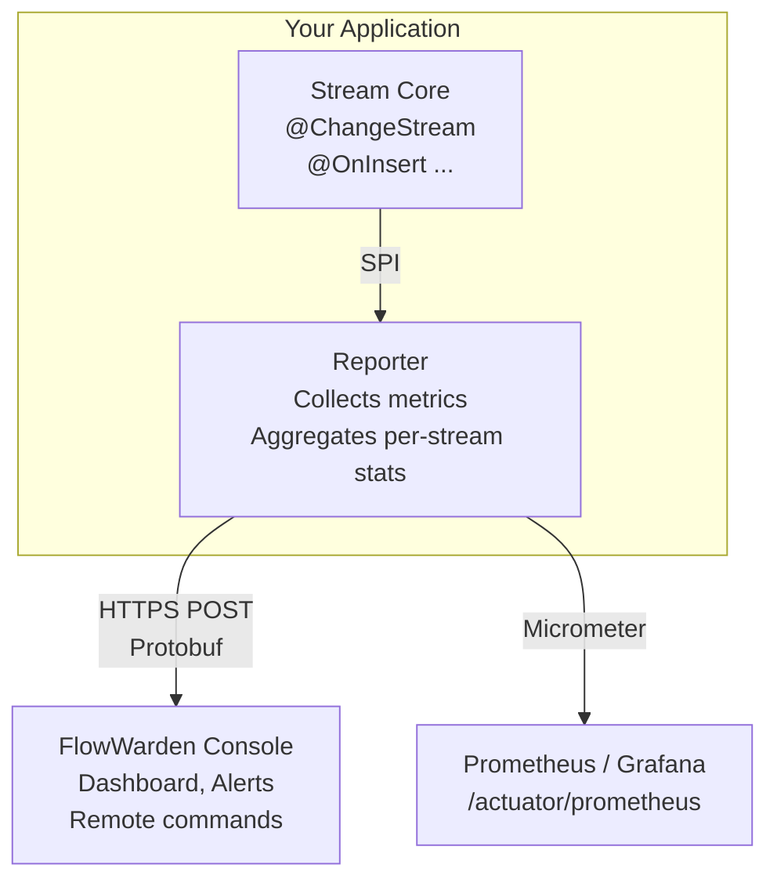

FlowWarden Reporter is an open-source Spring Boot library that bridges [FlowWarden Stream Core](/quickstart) and the **FlowWarden Console**. Drop it onto your classpath and your application automatically starts reporting stream health, metrics, and checkpoint status — no code changes required.

## Two Modes of Operation

The Reporter supports two independent modes that can run simultaneously:

| Mode | Activation | Prerequisites |
|------|-----------|---------------|
| **Console** | `flowwarden.api-key` + `flowwarden.reporter.console-url` configured | FlowWarden Console account |
| **Local / Prometheus** | Automatic when `MeterRegistry` is on the classpath | `spring-boot-starter-actuator` + `micrometer-registry-prometheus` |

Both modes share the same `StreamMetricsAggregator` — no duplicate collection.

## What Gets Reported

Each heartbeat (Console mode) or scrape (Prometheus mode) contains:

| Data | Console | Prometheus |
|------|---------|------------|
| **Stream status** (running, paused, error, stopped) | ✅ | — |
| **Event counters** (processed, errors, DLQ) | ✅ | ✅ `flowwarden_stream_events_total` |
| **Consumer lag** (ms) | ✅ | ✅ `flowwarden_stream_lag_ms` |
| **DLQ size** | ✅ | ✅ `flowwarden_stream_dlq_size` |
| **Throughput** (events/sec) | ✅ | ✅ `flowwarden_stream_events_per_second` |
| **Checkpoint info** (last seen age, events behind) | ✅ | — |
| **JVM metrics** (heap, CPU, threads) | ✅ | — |
| **Error details** (type, message, stack trace) | ✅ | — |
| **Deployment info** (hostname, version, env) | ✅ | — |

## Key Features

<CardGroup cols={2}>
  <Card title="Zero-code integration" icon="wand-magic-sparkles">
    Just add the dependency. The Reporter auto-configures via Spring Boot.
  </Card>
  <Card title="Dual mode" icon="code-branch">
    Console mode, Prometheus mode, or both simultaneously. Use what fits your stack.
  </Card>
  <Card title="Resilient" icon="shield-halved">
    Retries with exponential backoff. Graceful degradation if the Console is unreachable.
  </Card>
  <Card title="Dynamic interval" icon="clock">
    The Console controls the heartbeat frequency via the ACK response — no restart needed.
  </Card>
</CardGroup>

## Prerequisites

- **FlowWarden Stream Core** on your classpath (the Reporter implements its `StreamMetricsProvider` SPI)
- **Java 17+** and **Spring Boot 3.2+**
- For Console mode: a **FlowWarden Console** account with an API key
- For Prometheus mode: `spring-boot-starter-actuator` + `micrometer-registry-prometheus` on the classpath

## Next Steps

<CardGroup cols={2}>
  <Card title="Quick Start" icon="rocket" href="/reporter/quickstart">
    Add the Reporter to your project in 5 minutes.
  </Card>
  <Card title="Configuration" icon="gear" href="/reporter/configuration">
    Full reference of all Reporter properties.
  </Card>
</CardGroup>
