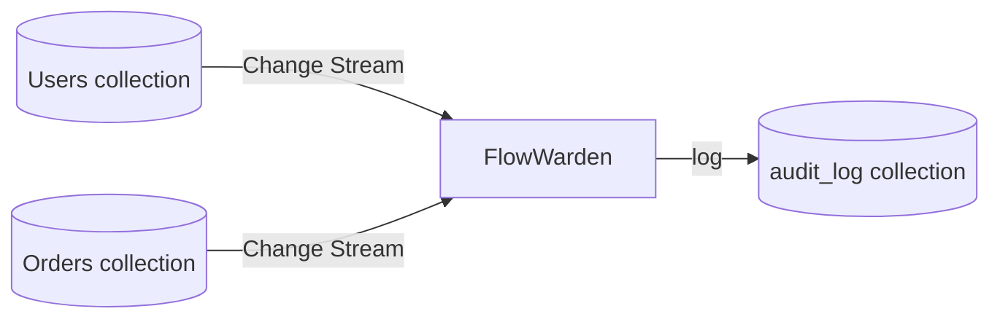

<Note>This page is a placeholder. Full content coming soon.</Note>

## Overview

Use FlowWarden to capture **every insert, update, and delete** on sensitive collections and write them to a dedicated audit log — for compliance, debugging, or analytics.

## Why FlowWarden

- **Checkpointing** guarantees no change is missed, even after restarts
- **`@OnChange`** captures all operation types in a single handler
- **`@Filter`** scopes the stream to only the collections that require auditing
