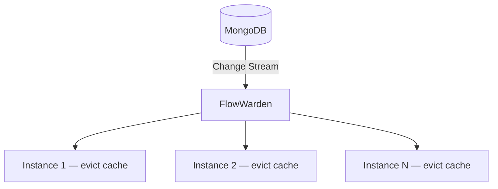

<Note>This page is a placeholder. Full content coming soon.</Note>

## Overview

Use FlowWarden in **`ALL_INSTANCES`** deployment mode to broadcast cache invalidation events to every running instance of your application.

## Why FlowWarden

- **`ALL_INSTANCES` mode** ensures every node receives the event
- **Sub-second latency** — no polling, no TTL guessing
- **`@Filter`** to react only to updates on cacheable collections
