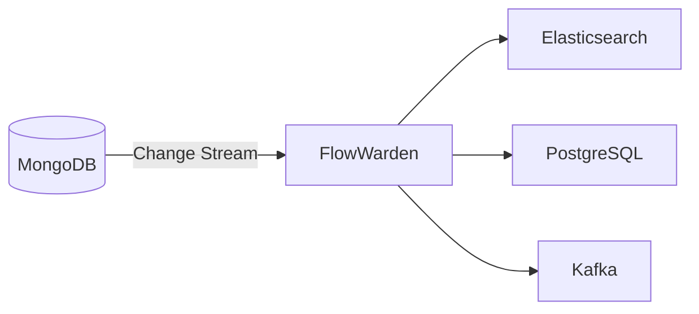

<Note>This page is a placeholder. Full content coming soon.</Note>

## Overview

Use FlowWarden as a **CDC pipeline** to propagate MongoDB changes to external systems — Elasticsearch, PostgreSQL, Kafka, or any downstream service.

## Why FlowWarden

- **Resume tokens** guarantee at-least-once delivery across restarts
- **DLQ** captures events that fail to sync, for manual replay
- **`@Filter`** lets you select only the collections and operations that matter
