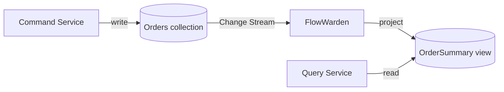

<Note>This page is a placeholder. Full content coming soon.</Note>

## Overview

Use FlowWarden to maintain **read-model projections** in a CQRS architecture. Write to your command collection; FlowWarden listens to Change Streams and updates denormalized read views in real time.

## Why FlowWarden

- **Checkpointing** ensures no event is lost between restarts
- **Retry + DLQ** handles transient projection failures
- **Filtering** lets you react only to relevant operation types
